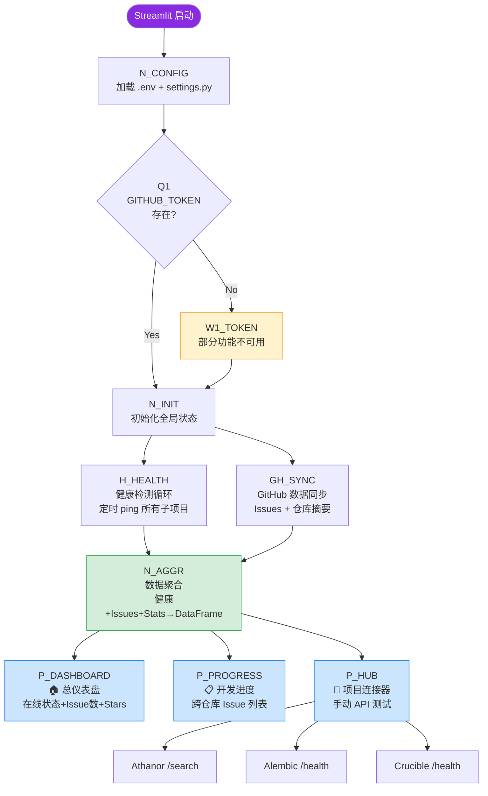

# OpusMagnum · 巨作 — 流程框图

> 总指挥部内部数据流。
> 蓝图见 [BLUEPRINT.md](BLUEPRINT.md)，管理流程见 [workflow/](workflow/)。

---

## 主干流程图

---

## 节点定义

### 启动与配置

| 节点 | 名称 | 输入 | 输出 | 逻辑 |
|:--:|------|------|------|------|
| N_CONFIG | 加载配置 | .env 文件 | settings 单例 | dotenv 加载 → ProjectConfig 初始化 5 个项目 |
| Q1 | Token 检查 | GITHUB_TOKEN | 路由 | 空字符串 → 降级模式；有值 → 全功能 |
| W1_TOKEN | 无 Token 警告 | — | 警告提示 | 仪表盘显示"配置 GitHub Token 以启用完整功能" |
| N_INIT | 初始化全局状态 | settings | st.session_state | 创建 ISSUES_DF / HEALTH_STATUS / REPO_STATS |

### 数据采集

| 节点 | 名称 | 输入 | 输出 | 逻辑 |
|:--:|------|------|------|------|
| H_HEALTH | 健康检测循环 | ProjectConfig ×4 | 在线/离线状态 | requests.get(/health) → 200=在线 其他=离线 |
| GH_SYNC | GitHub 数据同步 | GITHUB_TOKEN + repo 名 | Issue 列表 + 仓库统计 | PyGithub → list_issues + stars/forks/last_commit |

### 数据聚合

| 节点 | 名称 | 输入 | 输出 | 逻辑 |
|:--:|------|------|------|------|
| N_AGGR | 数据聚合 | 健康状态 + Issue 列表 + 仓库统计 | 3 个 DataFrame | Pandas merge → dashboard_df / issues_df / repo_stats_df |

### UI 展示

| 节点 | 名称 | 输入 | 输出 | 逻辑 |
|:--:|------|------|------|------|
| P_DASHBOARD | 总仪表盘 | dashboard_df | 在线状态卡片 + Issue 数 | Streamlit st.metric + st.dataframe |
| P_PROGRESS | 开发进度 | issues_df | 跨仓库 Issue 表格 | 按仓库分组 → 筛选 Open/Closed |
| P_HUB | 项目连接器 | settings | API 连通性测试结果 | 手动触发 → athanor_search / alembic_health / crucible_health |

---

## 连线表

| 起 → 止 | 触发条件 | 说明 |
|---------|---------|------|
| Start → N_CONFIG | Streamlit 启动 | 自动 |
| N_CONFIG → Q1 | 配置加载完成 | — |
| Q1 → W1_TOKEN | GITHUB_TOKEN 为空或无效 | 降级模式 |
| Q1 → N_INIT | Token 有效 | 全功能模式 |
| W1_TOKEN → N_INIT | 警告已生成 | — |
| N_INIT → H_HEALTH | 初始化完成 | 并行启动 |
| N_INIT → GH_SYNC | 初始化完成 | 并行启动 |
| H_HEALTH → N_AGGR | 健康检测完成 | — |
| GH_SYNC → N_AGGR | GitHub 同步完成 | — |
| N_AGGR → P_DASHBOARD | 数据聚合完成 | 自动渲染 |
| N_AGGR → P_PROGRESS | 数据聚合完成 | 自动渲染 |
| N_AGGR → P_HUB | 数据聚合完成 | 用户切换页面 |
| P_HUB → AthAPI | 用户点击"搜索 Athanor" | — |
| P_HUB → AleAPI | 用户点击"Ping Alembic" | — |
| P_HUB → CruAPI | 用户点击"Ping Crucible" | — |

---

## 外部依赖

| 依赖 | 端点 | 用途 | 失败影响 |
|------|------|------|----------|
| Athanor | `http://localhost:8080/health` | 健康检测 | 仪表盘显示离线 |
| Athanor | `http://localhost:8080/api/search` | 项目连接器 | 连接器搜索失败 |
| Alembic | `http://localhost:8502/health` | 健康检测 + 连接器 | 仪表盘显示离线 |
| Crucible | `http://localhost:8503/health` | 健康检测 + 连接器 | 仪表盘显示离线 |
| GitHub API | `api.github.com` | Issues + Stats 同步 | 仪表盘回退到健康检测 |

---

> **版本**: v1 | **对应 BLUEPRINT.md**: v1 | **更新日期**: 2026-06-17
