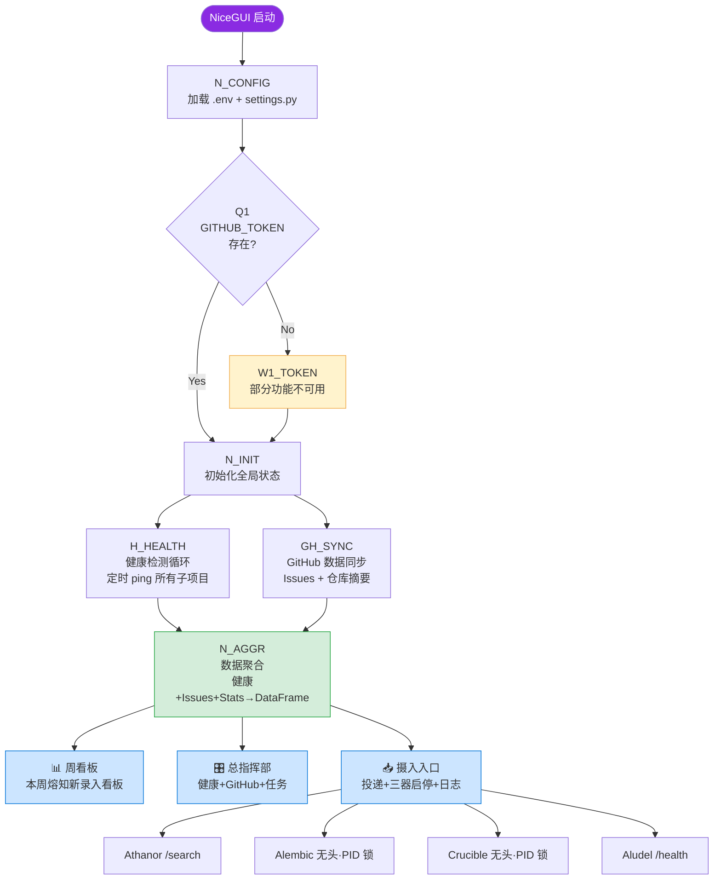

# OpusMagnum · 巨作 — 流程框图

> 总指挥部内部数据流。
> 蓝图见 [BLUEPRINT.md](BLUEPRINT.md)，管理流程见 [workflow/](workflow/)。

---

## 主干流程图

```mermaid
flowchart TB
    Start([NiceGUI 启动]) --> Config[N_CONFIG<br/>加载 .env + settings.py]
    Config --> Token{Q1<br/>GITHUB_TOKEN<br/>存在?}
    Token -->|No| NoToken[W1_TOKEN<br/>部分功能不可用]
    Token -->|Yes| Init

    NoToken --> Init[N_INIT<br/>初始化全局状态]

    Init --> Health[H_HEALTH<br/>健康检测循环<br/>定时 ping 所有子项目]
    Init --> GH[GH_SYNC<br/>GitHub 数据同步<br/>Issues + 仓库摘要]

    Health --> Aggr[N_AGGR<br/>数据聚合<br/>健康+Issues+Stats→DataFrame]

    GH --> Aggr

    Aggr --> Dash[📊 周看板<br/>本周熔知新录入看板]
    Aggr --> Progress[🎛️ 总指挥部<br/>健康+GitHub+任务]
    Aggr --> Hub[📥 摄入入口<br/>投递+三器启停+日志]

    Hub --> AthAPI[Athanor /search]
    Hub --> AleAPI[Alembic 无头·PID 锁]
    Hub --> CruAPI[Crucible 无头·PID 锁]
    Hub --> AluAPI[Aludel /health]

    style Start fill:#8A2BE2,color:#fff
    style NoToken fill:#fff3cd,stroke:#f0ad4e
    style Aggr fill:#d4edda,stroke:#28a745
    style Dash fill:#cce5ff,stroke:#0275d8
    style Progress fill:#cce5ff,stroke:#0275d8
    style Hub fill:#cce5ff,stroke:#0275d8
```

---

## 节点定义

### 启动与配置

| 节点 | 名称 | 输入 | 输出 | 逻辑 |
|:--:|------|------|------|------|
| N_CONFIG | 加载配置 | .env 文件 | settings 单例 | dotenv 加载 → ProjectConfig 初始化 5 个项目 |
| Q1 | Token 检查 | GITHUB_TOKEN | 路由 | 空字符串 → 降级模式；有值 → 全功能 |
| W1_TOKEN | 无 Token 警告 | — | 警告提示 | 仪表盘显示"配置 GitHub Token 以启用完整功能" |
| N_INIT | 初始化全局状态 | settings | st.session_state | 创建 ISSUES_DF / HEALTH_STATUS / REPO_STATS |

### 数据采集

| 节点 | 名称 | 输入 | 输出 | 逻辑 |
|:--:|------|------|------|------|
| H_HEALTH | 健康检测循环 | ProjectConfig ×4 | 在线/离线状态 | 熔知/凝华探 /health；馏析/炼真查 PID 锁文件（headless 无 HTTP） |
| GH_SYNC | GitHub 数据同步 | GITHUB_TOKEN + repo 名 | Issue 列表 + 仓库统计 | requests → list_issues + stars/forks/last_commit |

### 数据聚合

| 节点 | 名称 | 输入 | 输出 | 逻辑 |
|:--:|------|------|------|------|
| N_AGGR | 数据聚合 | 健康状态 + Issue 列表 + 仓库统计 | 3 个 DataFrame | Pandas merge → dashboard_df / issues_df / repo_stats_df |

### UI 展示

| 节点 | 名称 | 输入 | 输出 | 逻辑 |
|:--:|------|------|------|------|
| P_DASHBOARD（周看板） | 本周熔知新录入 | week_docs | 来源/主题/时间卡片 | NiceGUI ui.card + ui.label（直读 Qdrant） |
| P_PROGRESS（总指挥部） | 健康+GitHub+任务 | health/issues/repo | 状态灯+Issue 表 | NiceGUI ui.label 渲染 |
| P_HUB（摄入入口） | 投递+三器启停 | ingest_router + launcher | 队列概览+日志 | 贴链接/上传/笔记 → route_*；启停按钮 → launcher |

---

## 连线表

| 起 → 止 | 触发条件 | 说明 |
|---------|---------|------|
| Start → N_CONFIG | NiceGUI 启动 | 自动 |
| N_CONFIG → Q1 | 配置加载完成 | — |
| Q1 → W1_TOKEN | GITHUB_TOKEN 为空或无效 | 降级模式 |
| Q1 → N_INIT | Token 有效 | 全功能模式 |
| W1_TOKEN → N_INIT | 警告已生成 | — |
| N_INIT → H_HEALTH | 初始化完成 | 并行启动 |
| N_INIT → GH_SYNC | 初始化完成 | 并行启动 |
| H_HEALTH → N_AGGR | 健康检测完成 | — |
| GH_SYNC → N_AGGR | GitHub 同步完成 | — |
| N_AGGR → P_DASHBOARD | 数据聚合完成 | 自动渲染 |
| N_AGGR → P_PROGRESS | 数据聚合完成 | 自动渲染 |
| N_AGGR → P_HUB | 数据聚合完成 | 用户切换页面 |
| P_HUB → AthAPI | 用户点击"搜索 Athanor" | — |
| P_HUB → AleAPI | 用户点击"Ping Alembic" | — |
| P_HUB → CruAPI | 用户点击"Ping Crucible" | — |
| P_HUB → AluAPI | 用户点击"Ping Aludel" | — |

---

## 外部依赖

| 依赖 | 端点 | 用途 | 失败影响 |
|------|------|------|----------|
| Athanor | `http://localhost:8080/health` | 健康检测 | 仪表盘显示离线 |
| Athanor | `http://localhost:8080/api/search` | 项目连接器 | 连接器搜索失败 |
| Alembic（馏析） | 无头常驻（无 HTTP） | 健康检测改查 PID 锁 | 摄入入口状态灯显示离线 |
| Crucible（炼真） | 无头常驻（无 HTTP） | 健康检测改查 PID 锁 | 摄入入口状态灯显示离线 |
| Aludel | `http://localhost:8765/health` | 健康检测 + 连接器 | 仪表盘显示离线 |
| GitHub API | `api.github.com` | Issues + Stats 同步 | 仪表盘回退到健康检测 |

---

> **版本**: v1.2 | **更新日期**: 2026-07-27（框架收尾：巨作迁 NiceGUI、馏析/炼真改无头）
