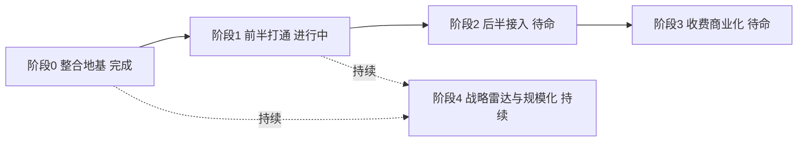

# Opus Magnum — 项目计划（详细路线图）

> 版本：v0.4.0 | 更新于：2026-07-11
> 本文件是巨作的唯一路线图 / 计划源。蓝图见 [BLUEPRINT.md](BLUEPRINT.md)；前半部分整合研究见 [docs/FRONT-HALF-INTEGRATION-RESEARCH-2026-07-11.md](docs/FRONT-HALF-INTEGRATION-RESEARCH-2026-07-11.md)。

---

## 当前状态

- **当前阶段**：前半部分整合 **M0 已落地**，M1–M4 进行中
- **下一个里程碑**：**M4 端到端验收**（贴一个 B站 链接，自动跑完「下载字幕 → 炼真出鉴定报告 → 丢进熔知自动入库」，结果带真伪标注）
- **五器现状**：馏析 / 炼真 / 熔知 / 凝华 / 巨作 各自独立仓库，独立可跑、独立可卖
- **战略雷达**：已自动化上线（每日 AI 新闻扫描 → 项目匹配 → `research-queue.md` 分级追加）
- **Git 状态**：main 分支，已推送 GitHub

---

## 段落索引（grep 关键词）

| 想找什么 | grep 关键词 |
|-----------|-------------|
| 当前状态 | `## 当前状态` |
| 详细路线图 | `## 巨作详细路线图` |
| 当前优先事项 | `## 当前阶段优先事项` |
| 工程纪律 | `## 贯穿全局的工程纪律` |
| 风险 | `## 风险提示` |
| 已知问题 / 技术债 | `## 已知问题` |

---

## 巨作详细路线图（总览）

| 阶段 | 一句话目标 | 关键交付 | 状态 |
|------|-----------|---------|:--:|
| **阶段 0** | 把三个独立项目用最轻方式绑成能统一管理的整体 | M0 整合骨架 | ✅ 完成 |
| **阶段 1** | 贴链接自动跑完全程：采→验→存 | M1–M4 | 🔴 进行中 |
| **阶段 2** | 把"知识→赚钱"后半截也并进来统一管理 | 凝华接入 + 全链路看板 | ⚪ 待命 |
| **阶段 3** | 落实"大部分开源、核心收费" | 物理隔离 + 激活码 + 分层 | ⚪ 待命 |
| **阶段 4** | 战略雷达调优 + 护城河能力 | 矛盾检测 / 关系网 / 多平台分发 | 🟡 持续 |

---

### 阶段 0 — 整合地基（✅ 已完成）

> 目标：在不破坏"五器各自独立仓库、可单独卖"的前提下，给前半部分加一层统一管理。

| 任务 | 内容 | 落点 | 状态 |
|------|------|------|:--:|
| M0-1 统一视图 | `front_half/nigredo\|albedo\|citrinitas` 三个目录联接指向真实仓库；`.gitignore` 忽略联接（保留 `supervisor/` 真实代码） | 巨作 | ✅ |
| M0-2 总管骨架 | NiceGUI 总管（贴链接框 + 开始按钮 + 三段进度区）；编排逻辑 `orchestrator.py` 与界面解耦 | 巨作 `front_half/supervisor/` | ✅ |
| M0-3 统一启动 | 4 个 `run.bat` 统一模板（venv 优先 + 回退 + ★横幅）；`front_half/launch.bat` 总启动器（先起熔知→等→起总管）；`docs/PORTS.md` | 巨作 + 三器 | ✅ |
| M0-4 补 LICENSE | nigredo / albedo / opus-magnum 补 MIT LICENSE（熔知已有） | 四仓库 | ✅ |
| M0-5 依赖清理 | 去 AGPL `ebooklib`（自写 `epub_reader.py`）/ LGPL `pygithub`→requests / `chardet`→`charset_normalizer` | 熔知 + 巨作 | ✅ |
| **M0-6 共享 LLM 客户端库** | 三器各自调 AI 的代码整合为一处：统一管理 API Key / 模型选择 / **强制 temperature=0** / 失败重试 / 结构化输出 / 花销统计。**落点**：巨作仓库下新建共享模块（如 `shared/llm_client/`），三器改为 import 它；馏析（当前散落 3 文件）/ 熔知（散落分类/搜索/OCR 等多处）优先收敛，炼真 `core/llm.py` 作参考基线。**归属**：未来由巨作统一管理。 | 巨作 + 三器 | ⚪ 待开工 |

**意义**：三个独立项目用最轻的"文件夹传送带 + 共享契约"绑成一条自动线，且随时可拆——馏析未来要单独卖直接拿走即可，零成本。

---

### 阶段 1 — 前半部分打通（🔴 进行中）

> 目标：你说一句"分析这个 B站 视频"，系统自动跑完「下载字幕 → 炼真出鉴定报告 → 丢进熔知自动入库」，全程界面可见进度。对应蓝图 4 条验收标准。

| 任务 | 内容 | 落点 | 状态 |
|------|------|------|:--:|
| **M1** 炼真熔知-ready 导出 | 炼真产出一个"信息头 + 人读报告"合体文件：信息头含来源/真伪结论/信任分/变现标注/分面预填，供熔知直接读；报告正文人能直接看 | 炼真内部（小改） | ⚪ 待开工 |
| **M2** 熔知信息头解析 + 虚假标注 | 收件箱读信息头 → 映射真伪字段（epistemic_status / trust_score）→ UI 标「可疑/虚假」+ 支持按真伪过滤 | 熔知内部（小改） | ⚪ 待开工 |
| **M3** 总管串起真实 B站 路线 | 界面点「开始」→ 馏析出字幕 → 炼真产合体文件 → 投熔知收件箱 → 自动入库 → 界面显进度 | 巨作 `supervisor/` | ⚪ 待开工 |
| **M4** 端到端验收 | 真实 B站 链接跑通，结果进熔知并带真伪标注；对照蓝图 4 条验收标准逐条过 | 全链路 | ⚪ 待开工 |

**设计已锁定**（见整合研究报告第十一节）：
- Q1 = 总管从一开始就有界面（非命令行）
- Q2 = 炼真直接产"熔知专用 + 人可读"合体文件，总管原样投递、不加中间层
- Q3 = 不硬拦截，内容全入库；真伪结论随信息头进熔知，由熔知负责标「可疑/虚假」+ 过滤

---

### 阶段 2 — 后半部分接入（⚪ 待命）

> 目标：把"知识 → 赚钱"的后半截（凝华）也并进巨作统一管理，同时保留它独立可卖。

| 任务 | 内容 | 落点 | 状态 |
|------|------|------|:--:|
| 凝华接入画布 | `front_half/rubedo` 目录联接 + 统一 `run.bat` + 进总管看板 | 巨作 + 凝华 | ⚪ 待命 |
| 全链路看板 | 总管升级：采/验/存（前半）+ 接单/创作/分发（后半）一屏可见 | 巨作 `supervisor/` | ⚪ 待命 |
| 能力保留 | 凝华现有能力（酷家乐 SOP、时间审计、小红书代发）保持独立可卖 | 凝华 | ✅ 现状 |

---

### 阶段 3 — 收费与商业化（⚪ 待命）

> 目标：把"大部分开源、核心收费"（open-core）从设计落到代码。前提：等 M1–M4 跑通、确定哪些真是"核心"再实现，不提前锁死。

| 任务 | 内容 | 状态 |
|------|------|:--:|
| 物理隔离 | `core/`(开源) vs `core/premium/`(闭源) 目录边界已定，待按真实核心落子模块 | ⚪ 边界已定 / 实现待命 |
| 激活码模块 | 离线机器指纹 + 签名校验，解锁专业版（Crucible 信任聚合 / 跨源矛盾检测 / 高级语义搜索） | ⚪ 待命 |
| 收费分层 | 个人本地版免费 / 专业版激活码 / 团队版（多用户 + 云端同步） | ⚪ 待命 |
| LICENSE 策略 | 开源 MIT / 闭源商业 EULA，核心物理隔离（M0-4 已补开源 LICENSE） | 🟡 部分完成 |

---

### 阶段 4 — 战略雷达与规模化（🟡 持续）

> 目标：让"模仿飞轮"越转越聪明，并构筑市面无竞品的护城河。

| 任务 | 内容 | 状态 |
|------|------|:--:|
| 战略雷达调优 | 四层过滤（项目匹配 → 研究队列）+ `research-queue.md` 分级（🔴🟡⚪💡） | ✅ 已上线 / 🟡 持续调 |
| 跨源矛盾检测 | B站视频 + 个人知识库 + 网页文章统一比对（护城河：市面无同类产品） | ⚪ 待命 |
| 知识关系网 | 知识点互联、高级语义搜索（闭源增值点） | ⚪ 待命 |
| 多平台分发自动化 | B站 / 小红书 / 公众号 一键分发 | ⚪ 待命 |

---

## 当前阶段优先事项

| 优先级 | 事项 | 理由 |
|--------|------|------|
| ✅ **已完成** | 阶段 0 整合地基（M0 全部 5 步） | 统一管理骨架就位，五器仍独立可卖 |
| ✅ **已完成** | 战略雷达自动化上线 | 每日 AI 新闻 → 项目匹配 → research-queue.md |
| 🔴 P0 | **M1 炼真熔知-ready 导出** | 前半部分打通的第一块拼图，没有它总管无内容可投 |
| 🔴 P0 | **M2 熔知信息头解析 + 虚假标注** | 验收标准③"虚假信息自动拦截"的落点 |
| 🟡 P1 | **M3 总管串真实 B站 路线** | 把 M1/M2 用界面串成自动线，兑现"一句话触发" |
| 🟡 P1 | **M4 端到端验收** | 对照蓝图 4 条验收标准逐条过 |
| ⚪ P3 | 阶段 2 后半部分接入（凝华） | M1–M4 跑通后再接，避免范围蔓延 |
| ⚪ P3 | 阶段 3 收费商业化 | 确定核心后再写激活码，不提前锁死 |

---

## 贯穿全局的工程纪律

| 纪律 | 说明 |
|------|------|
| **依赖合规零包袱** | 永远零 AGPL / LGPL 包袱（M0-5 已清零）；新增任何依赖必审授权 |
| **LICENSE 策略** | 开源用 MIT、闭源用商业 EULA；核心代码物理隔离（`core/premium/`） |
| **命名统一** | 五器采用两段式命名（炼金阶段 + 英文功能名：Nigredo=Alembic / Albedo=Crucible / Citrinitas=Athanor / Rubedo=Aludel）；代码/文档混用纯功能名与纯阶段名，需统一为两段式（**不清除英文功能名**） |
| **端口 / 启动规范** | 固定端口表见 `docs/PORTS.md`；统一 `run.bat` 模板 + `front_half/launch.bat` 总启动器 |
| **MVP 优先** | 每次只做验证最重要问题的最小改动，不做提前优化 |
| **自动化优先** | 能自动不要手动，零人工干预 |

---

## 风险提示

| 风险 | 严重度 | 应对 |
|------|--------|------|
| **工具开发挤压赚钱时间** | 🔴 高 | 严格 MVP + 自动化优先；整合只做"能直接帮赚钱的"最小闭环 |
| **平台 API 收紧**（小红书 / B站尤甚） | 🔴 高 | 多平台分散，浏览器自动化兜底，不过度依赖 API |
| **B站 ToS 合规**（商品化馏析时） | 🔴 高 | 商品化时只处理用户自传/CC 内容，或请法律过一遍抓取条款（yt-dlp 本身 Unlicense 可商用） |
| **单人精力瓶颈** | 🟡 中 | MVP 原则 + 敢于取舍 |
| **知识库被虚假信息污染** | 🟡 中 | M2 上线前靠手动验证；M2 后由熔知标「可疑/虚假」+ 过滤 |
| **GitHub Token 暴露** | 🔴 高 | 仓库 remote URL 含 PAT，建议改 SSH 或移除历史 |
| **模型授权** | 🟡 中 | Qwen3-Embedding(Apache2.0) 须保留 NOTICE、不用"Qwen"商标；DeepSeek(MIT/商家条款) 守规矩 |

---

## 已知问题

- [ ] 代码/文档统一为两段式命名（阶段名 + 英文功能名 Alembic/Crucible/Athanor/Aludel），**非清除英文功能名**；当前 api_spec/FLOWCHART/schemas 用纯功能名、部分文档用纯阶段名，需对齐
- [ ] `FLOWCHART.md` 端口与旧名过时（仍写 PyGithub、Crucible→8503 实为总管、Albedo 端口错写为 8503 而非 8501）——待单独修订
- [ ] 阶段 3 激活码模块未实现（按决策 S3：等 M1–M4 跑通再写）

## 技术债

- [ ] 代码内路径引用按两段式规范核对（Nigredo 目录 `alembic/` 等英文功能名保留，不强制改阶段名）；以两段式统一呈现为准
- [ ] 凝华未克隆到本地前的整合路径需在使用时确认（`D:\rubedo\` 已存在则直接 junction）
- [ ] **三器 LLM 调用各自为政**（见 M0-6）：馏析散落 3 文件、熔知散落分类/搜索/OCR 多处、炼真已规范（`core/llm.py`）；未统一前，"AI 不严格 temperature=0 导致结果抖动"类老问题无法从根上锁死。M0-6 待开工即解决。
