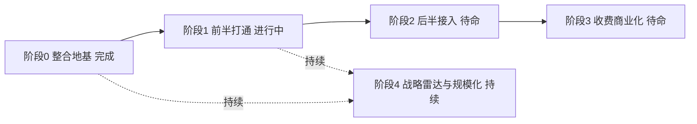

# Opus Magnum — 项目计划（详细路线图）

> 版本：v0.4.0 | 更新于：2026-07-11
> 本文件是巨作的唯一路线图 / 计划源。蓝图见 [BLUEPRINT.md](BLUEPRINT.md)；前半部分整合研究见 [docs/FRONT-HALF-INTEGRATION-RESEARCH-2026-07-11.md](docs/FRONT-HALF-INTEGRATION-RESEARCH-2026-07-11.md)。

---

## 当前状态

- **当前阶段**：前半部分整合 **M0 已落地**，M1–M4 进行中
- **下一个里程碑**：**M4 端到端验收**（贴一个 B站 链接，自动跑完「下载字幕 → 炼真出鉴定报告 → 丢进熔知自动入库」，结果带真伪标注）
- **五器现状**：馏析 / 炼真 / 熔知 / 凝华 / 巨作 各自独立仓库，独立可跑、独立可卖
- **战略雷达**：已自动化上线（每日 AI 新闻扫描 → 项目匹配 → `research-queue.md` 分级追加）
- **Git 状态**：main 分支，已推送 GitHub

---

## 段落索引（grep 关键词）

| 想找什么 | grep 关键词 |
|-----------|-------------|
| 当前状态 | `## 当前状态` |
| 详细路线图 | `## 巨作详细路线图` |
| 当前优先事项 | `## 当前阶段优先事项` |
| 工程纪律 | `## 贯穿全局的工程纪律` |
| 风险 | `## 风险提示` |
| 已知问题 / 技术债 | `## 已知问题` |

---

## 巨作详细路线图（总览）


```mermaid
flowchart LR
    S0[阶段0 整合地基 完成] --> S1[阶段1 前半打通 进行中]
    S1 --> S2[阶段2 后半接入 待命]
    S2 --> S3[阶段3 收费商业化 待命]
    S1 -.持续.-> S4[阶段4 战略雷达与规模化 持续]
    S0 -.持续.-> S4
```

| 阶段 | 一句话目标 | 关键交付 | 状态 |
|------|-----------|---------|:--:|
| **阶段 0** | 把三个独立项目用最轻方式绑成能统一管理的整体 | M0 整合骨架 | ✅ 完成 |
| **阶段 1** | 贴链接自动跑完全程：采→验→存 | M1–M4 | 🔴 进行中 |
| **阶段 2** | 把"知识→赚钱"后半截也并进来统一管理 | 凝华接入 + 全链路看板 | ⚪ 待命 |
| **阶段 3** | 落实"大部分开源、核心收费" | 物理隔离 + 激活码 + 分层 | ⚪ 待命 |
| **阶段 4** | 战略雷达调优 + 护城河能力 | 矛盾检测 / 关系网 / 多平台分发 | 🟡 持续 |

---

### 阶段 0 — 整合地基（✅ 已完成）

> 目标：在不破坏"五器各自独立仓库、可单独卖"的前提下，给前半部分加一层统一管理。

| 任务 | 内容 | 落点 | 状态 |
|------|------|------|:--:|
| M0-1 统一视图 | `front_half/nigredo\|albedo\|citrinitas` 三个目录联接指向真实仓库；`.gitignore` 忽略联接（保留 `supervisor/` 真实代码） | 巨作 | ✅ |
| M0-2 总管骨架 | NiceGUI 总管（贴链接框 + 开始按钮 + 三段进度区）；编排逻辑 `orchestrator.py` 与界面解耦 | 巨作 `front_half/supervisor/` | ✅ |
| M0-3 统一启动 | 4 个 `run.bat` 统一模板（venv 优先 + 回退 + ★横幅）；`front_half/launch.bat` 总启动器（先起熔知→等→起总管）；`docs/PORTS.md` | 巨作 + 三器 | ✅ |
| M0-4 补 LICENSE | nigredo / albedo / opus-magnum 补 MIT LICENSE（熔知已有） | 四仓库 | ✅ |
| M0-5 依赖清理 | 去 AGPL `ebooklib`（自写 `epub_reader.py`）/ LGPL `pygithub`→requests / `chardet`→`charset_normalizer` | 熔知 + 巨作 | ✅ |
| **M0-6 共享 LLM 客户端库** | 三器各自调 AI 的代码整合为一处：统一管理 API Key / 模型选择 / **强制 temperature=0** / 失败重试 / 结构化输出 / 花销统计。**落点**：巨作仓库下新建共享模块（如 `shared/llm_client/`），三器改为 import 它；馏析（当前散落 3 文件）/ 熔知（散落分类/搜索/OCR 等多处）优先收敛，炼真 `core/llm.py` 作参考基线。**归属**：未来由巨作统一管理。 | 巨作 + 三器 | ⚪ 待开工 |

**意义**：三个独立项目用最轻的"文件夹传送带 + 共享契约"绑成一条自动线，且随时可拆——馏析未来要单独卖直接拿走即可，零成本。

---

### 阶段 1 — 前半部分打通（🔴 进行中）

> 目标：你说一句"分析这个 B站 视频"，系统自动跑完「下载字幕 → 炼真出鉴定报告 → 丢进熔知自动入库」，全程界面可见进度。对应蓝图 4 条验收标准。

| 任务 | 内容 | 落点 | 状态 |
|------|------|------|:--:|
| **M1** 炼真熔知-ready 导出 | 炼真产出一个"信息头 + 人读报告"合体文件：信息头含来源/真伪结论/信任分/变现标注/分面预填，供熔知直接读；报告正文人能直接看 | 炼真内部（小改） | ⚪ 待开工 |
| **M2** 熔知信息头解析 + 虚假标注 | 收件箱读信息头 → 映射真伪字段（epistemic_status / trust_score）→ UI 标「可疑/虚假」+ 支持按真伪过滤 | 熔知内部（小改） | ⚪ 待开工 |
| **M3** 总管串起真实 B站 路线 | 界面点「开始」→ 馏析出字幕 → 炼真产合体文件 → 投熔知收件箱 → 自动入库 → 界面显进度 | 巨作 `supervisor/` | ⚪ 待开工 |
| **M4** 端到端验收 | 真实 B站 链接跑通，结果进熔知并带真伪标注；对照蓝图 4 条验收标准逐条过 | 全链路 | ⚪ 待开工 |

**设计已锁定**（见整合研究报告第十一节）：
- Q1 = 总管从一开始就有界面（非命令行）
- Q2 = 炼真直接产"熔知专用 + 人可读"合体文件，总管原样投递、不加中间层
- Q3 = 不硬拦截，内容全入库；真伪结论随信息头进熔知，由熔知负责标「可疑/虚假」+ 过滤

---

### 阶段 2 — 后半部分接入（⚪ 待命）

> 目标：把"知识 → 赚钱"的后半截（凝华）也并进巨作统一管理，同时保留它独立可卖。

> **【2026-07-24 新增·知识消费侧（用户提议 + AI 归类至本阶段）】** 周总结 / 活研究报告 / 文档浏览器 三者构成「用学到的东西」界面层，落点统一在**巨作总指挥部**（`app.py` NiceGUI 三标签之一，直接读熔知数据），不塞进凝华。边界（AI 设计决策，非用户铁律；方向已于 2026-07-24 经用户确认）：活研究报告 = 用户主动设主题的活文档（随知识库更新完善 + 列缺失项）；阶段 4「知识关系网」= 系统自动发现知识点关联——二者不重叠、不增殖。

| 任务 | 内容 | 落点 | 状态 |
|------|------|------|:--:|
| 凝华接入画布 | `front_half/rubedo` 目录联接 + 统一 `run.bat` + 进总管看板 | 巨作 + 凝华 | ⚪ 待命 |
| 全链路看板 | 总管升级：采/验/存（前半）+ 接单/创作/分发（后半）一屏可见 | 巨作 `app.py` 摄入入口/总指挥部 | ⚪ 待命 |
| 周总结看板（**MVP = 纯看板**） | **作为巨作首页（`app.py`）**：只读聚合本周熔知新录入（来源/主题/时间），一屏看板，**MVP 不依赖 LLM**；增强见本阶段下方「周总结 · 增强 backlog」 | 巨作 `app.py`（首页） | ⚪ 待命 |
| 活研究报告 + 文档浏览器 | 用户设定研究主题 → 生成「活文档」，随熔知知识库更新自我完善并列出缺失项；文档浏览器可浏览熔知向量库内文件并做笔记 | 巨作 `app.py` | ⚪ 待命 |
| 能力保留 | 凝华现有能力（酷家乐 SOP、时间审计、小红书代发）保持独立可卖 | 凝华 | ✅ 现状 |

> **【2026-07-25 页面整合·已落地】** 原 3 个子页面（总仪表盘 / 开发进度 / 项目连接器）的去重内容已合并为单一「🎛️ 总指挥部」标签（NiceGUI app.py），旧 3 页 + 整个 Streamlit 框架已于 2026-07-27 整体退役。健康检查仅留一份、GitHub API 速查仅一份、任务看板用开发进度超集（含筛选+统计）；侧边栏外链改读 `settings` 修正炼真端口写死 8503 的 bug。周看板后续作为巨作**首页** `app.py`（见上方周总结行）。

> **周总结 · 增强 backlog（⚪ 待命，MVP 之后按序做）** — MVP 仅做「纯看板」：只读聚合本周熔知新录入（来源/主题/时间），一屏看板，**不依赖 LLM**。以下为后续增量（来源：2026-07-25 竞品研究 Readwise / Reflect·Mem / Notion / Spotify Wrapped + 头脑风暴；标注为 AI 设计提案、非用户铁律，待用户逐条确认）：
>
> | 增强 | 大白话 | 技术 | 呼应 |
> |------|--------|------|------|
> | A 周报叙事 | 把列表变一段人话：「这周向 3 个 UP 主学了 12 条，冒出 2 个新主题，1 条被炼真标可疑」 | ✅ 需 LLM | 验收④越学越聪明 |
> | B 战果卡 | 一组小数字 + 连胜：录入 N 条 / 覆盖 M 领域 / 验证 K 条真假 / 连续学习 W 周 | ❌ 纯聚合 | Wrapped 式成就感 |
> | C 关联洞察 | 「这周新知识和你 3 周前存的 X 撞出了联系」（只读提示） | ❌ 纯比对 | 护城河先遣（≠ 阶段4 知识关系网） |
> | D 未消化提醒→行动 | 「5 条入库但还没关联任何主题，要处理吗？」 | ❌ 纯过滤 | 驱动学→用→赚闭环 |
> | E 多视图切换 | 看板可切「按主题 / 按来源(UP主) / 按真伪」 | ❌ 纯分组 | 最直接治「看板太单一」 |
> | F 一键导出 | 周报导出成文档，直接喂给凝华做内容 | ❌ 纯导出 | 知识→赚钱 |
> | G 对比上周 | 「比上周多学 20%，新领域 +2」 | ❌ 纯比对 | 让「变聪明」可见 |
>
> **设计原则（AI 提议，待确认）**：① 收敛不增殖——所有项服务「每周看到自己变聪明 + 知道下周拿知识去干嘛」，不堆独立 widget；② 程序优先于大模型——仅 A 真需 LLM，B/C/D/E/F/G 全纯程序（数数/分组/过滤/比对）；③ C 严守与阶段4知识关系网的边界（只读提示，不自动建网）。

---

### 阶段 3 — 收费与商业化（⚪ 待命）

> 目标：把"大部分开源、核心收费"（open-core）从设计落到代码。前提：等 M1–M4 跑通、确定哪些真是"核心"再实现，不提前锁死。

| 任务 | 内容 | 状态 |
|------|------|:--:|
| 物理隔离 | `core/`(开源) vs `core/premium/`(闭源) 目录边界已定，待按真实核心落子模块 | ⚪ 边界已定 / 实现待命 |
| 激活码模块 | 离线机器指纹 + 签名校验，解锁专业版（Crucible 信任聚合 / 跨源矛盾检测 / 高级语义搜索） | ⚪ 待命 |
| 收费分层 | 个人本地版免费 / 专业版激活码 / 团队版（多用户 + 云端同步） | ⚪ 待命 |
| LICENSE 策略 | 开源 MIT / 闭源商业 EULA，核心物理隔离（M0-4 已补开源 LICENSE） | 🟡 部分完成 |

---

### 阶段 4 — 战略雷达与规模化（🟡 持续）

> 目标：让"模仿飞轮"越转越聪明，并构筑市面无竞品的护城河。

| 任务 | 内容 | 状态 |
|------|------|:--:|
| 战略雷达调优 | 四层过滤（项目匹配 → 研究队列）+ `research-queue.md` 分级（🔴🟡⚪💡） | ✅ 已上线 / 🟡 持续调 |
| 跨源矛盾检测 | B站视频 + 个人知识库 + 网页文章统一比对（护城河：市面无同类产品） | ⚪ 待命 |
| 知识关系网 | 知识点互联、高级语义搜索（闭源增值点） | ⚪ 待命 |
| 多平台分发自动化 | B站 / 小红书 / 公众号 一键分发 | ⚪ 待命 |

---

## 当前阶段优先事项

| 优先级 | 事项 | 理由 |
|--------|------|------|
| ✅ **已完成** | 阶段 0 整合地基（M0 全部 5 步） | 统一管理骨架就位，五器仍独立可卖 |
| ✅ **已完成** | 战略雷达自动化上线 | 每日 AI 新闻 → 项目匹配 → research-queue.md |
| 🔴 P0 | **M1 炼真熔知-ready 导出** | 前半部分打通的第一块拼图，没有它总管无内容可投 |
| 🔴 P0 | **M2 熔知信息头解析 + 虚假标注** | 验收标准③"虚假信息自动拦截"的落点 |
| 🟡 P1 | **M3 总管串真实 B站 路线** | 把 M1/M2 用界面串成自动线，兑现"一句话触发" |
| 🟡 P1 | **M4 端到端验收** | 对照蓝图 4 条验收标准逐条过 |
| ⚪ P3 | 阶段 2 后半部分接入（凝华） | M1–M4 跑通后再接，避免范围蔓延 |
| ⚪ P3 | 阶段 3 收费商业化 | 确定核心后再写激活码，不提前锁死 |
| ✅ **已完成** | 数据层盘点定稿（Odoo 统一真相源借鉴） | 蓝图已加「数据层：谁管哪本账」模块 + [数据层盘点](docs/数据层盘点.md)；新增模块照地图归位，禁止第二个总账 |

---

## 贯穿全局的工程纪律

| 纪律 | 说明 |
|------|------|
| **依赖合规零包袱** | 永远零 AGPL / LGPL 包袱（M0-5 已清零）；新增任何依赖必审授权 |
| **LICENSE 策略** | 开源用 MIT、闭源用商业 EULA；核心代码物理隔离（`core/premium/`） |
| **命名统一** | 五器采用两段式命名（炼金阶段 + 英文功能名：Nigredo=Alembic / Albedo=Crucible / Citrinitas=Athanor / Rubedo=Aludel）；代码/文档混用纯功能名与纯阶段名，需统一为两段式（**不清除英文功能名**） |
| **端口 / 启动规范** | 固定端口表见 `docs/PORTS.md`；统一 `run.bat` 模板 + `front_half/launch.bat` 总启动器 |
| **MVP 优先** | 每次只做验证最重要问题的最小改动，不做提前优化 |
| **自动化优先** | 能自动不要手动，零人工干预 |

---

## 风险提示

| 风险 | 严重度 | 应对 |
|------|--------|------|
| **工具开发挤压赚钱时间** | 🔴 高 | 严格 MVP + 自动化优先；整合只做"能直接帮赚钱的"最小闭环 |
| **平台 API 收紧**（小红书 / B站尤甚） | 🔴 高 | 多平台分散，浏览器自动化兜底，不过度依赖 API |
| **B站 ToS 合规**（商品化馏析时） | 🔴 高 | 商品化时只处理用户自传/CC 内容，或请法律过一遍抓取条款（yt-dlp 本身 Unlicense 可商用） |
| **单人精力瓶颈** | 🟡 中 | MVP 原则 + 敢于取舍 |
| **知识库被虚假信息污染** | 🟡 中 | M2 上线前靠手动验证；M2 后由熔知标「可疑/虚假」+ 过滤 |
| **GitHub Token 暴露** | 🔴 高 | 仓库 remote URL 含 PAT，建议改 SSH 或移除历史 |
| **模型授权** | 🟡 中 | Qwen3-Embedding(Apache2.0) 须保留 NOTICE、不用"Qwen"商标；DeepSeek(MIT/商家条款) 守规矩 |

---

## 已知问题

- [ ] 代码/文档统一为两段式命名（阶段名 + 英文功能名 Alembic/Crucible/Athanor/Aludel），**非清除英文功能名**；当前 api_spec/FLOWCHART/schemas 用纯功能名、部分文档用纯阶段名，需对齐
- [x] `FLOWCHART.md` 端口与旧名过时（PyGithub / Crucible→8503 / Albedo 8503）→ 已于 2026-07-27 随框架收尾修订（巨作迁 NiceGUI、馏析/炼真改无头常驻）
- [ ] 阶段 3 激活码模块未实现（按决策 S3：等 M1–M4 跑通再写）

## 技术债

- [ ] 代码内路径引用按两段式规范核对（Nigredo 目录 `alembic/` 等英文功能名保留，不强制改阶段名）；以两段式统一呈现为准
- [ ] 凝华未克隆到本地前的整合路径需在使用时确认（`D:\rubedo\` 已存在则直接 junction）
- [ ] **三器 LLM 调用各自为政**（见 M0-6）：馏析散落 3 文件、熔知散落分类/搜索/OCR 多处、炼真已规范（`core/llm.py`）；未统一前，"AI 不严格 temperature=0 导致结果抖动"类老问题无法从根上锁死。M0-6 待开工即解决。

---

## 远期方法论储备（2026-08-04 起）

> 方法论级借鉴条目统一存这里（不开工只存档）。与熔知路线图"远期待办"、凝华路线图 R6 同规则：认可价值 → 存档 → 账本撤单 → 触发时机到了再启用。

### 远期：wayfinder 决策跟踪方法论（跨会话规划，升级行动清单+审核清单时启用）

**状态**：✅ 认可价值 · 方法论存档（用户 2026-08-04 定性："行动清单和审核清单都可以升级，这条更像方法论"）| doc_id：doc_b839dea878fed4e3

**它是什么**
Matt Pocock（知名 TS 教育者）的 wayfinder skill：把"跨会话工作"当成软件工程来管理——用 issue tracker（工单系统）管理**决策票**，每次会话只解决一个工单，避免对话漂移。用户定性：**这套东西的本质是方法论**（跨会话规划方法），不是单纯的功能按钮。

**核心机制**
- 决策票四态：**研究（research）/ 原型（prototype）/ 讨论（discussion）/ 任务（task）**
- 每次会话只解决一个工单 → 对话不漂移
- 决策留痕、有状态、可回溯

**与现有系统的关系（为什么行动清单+审核清单都能升级）**
- 已有：行动清单记账本（`state.json`，知识条目状态机）+ 审核清单记账本（`pending/state.json`，审批三态）——双账本状态机骨架已就位
- 差距：缺"决策票"层——**正在讨论/已拍板/已推翻的决策**没有留痕
- 痛点对应（用户亲口说过）：对话一中断，"上次为什么选 B 不选 A"就丢了 → 同一决策反复讨论
- **升级范围（用户拍板）**：不只是行动清单——行动清单和审核清单都可以用这套方法论升级（审核决策同样要留痕：为什么批准/为什么打回）

**未来落地路径**（升级双账本时，按序走，每步独立可停）
1. 决策票格式设计：标题 / 四态 / 理由 / 时间 / 关联 doc_id → 验收：模板字段齐全
2. `/decisions` 页面：serve.py 从决策票文件渲染列表 → 验收：页面能列出决策票
3. 与审核清单打通：批准/打回条目时自动开一张"已决定"决策票（理由即留痕）→ 验收：审批即留痕
4. 方法论落地：新对话开始先看决策票，不重复讨论已定的事 → 验收：中断后可从决策票恢复上下文

**触发时机**
双账本稳定运行一段时间、或"对话中断后重复决策"痛感明显时启用。方法论存档期**不动任何代码**。

**关联备注**
- 与凝华路线图 R6（OpenOPC）互补：wayfinder 管"决策过程留痕"，OpenOPC 管"执行经验沉淀（Playbook）"——一个管决策、一个管执行
- 与行动清单自动化（v3.6）配套：未来决策票可作为自动化调研"去重"的补充依据（同一决策不再重复调研）

---

### 远期：SkillOS 技能库管理方法论（技能三操作 + 防膨胀，巨作管 skill 生态）

**状态**：✅ 认可价值 · 方法论存档（用户 2026-08-04 定性："skill 本来就是巨作管理的"）| doc_id：doc_ccbc46fdf54d5298

**它是什么**
Google+MIT 论文（arXiv 2605.06614，2026-05）：把"技能库管理"做成可工程化训练的流程。**它不是软件也不是 SKILL.md 规则，而是一套训练方法**——训练一个专职"技能管理员"小模型（Skill Curator），让技能库从"只增不改"变成"持续维护"。

**核心机制（自我更新四步循环）**
```
① 干活：执行器（冻结不训练）从技能库检索相关技能（BM25）照着干活
② 复盘：干完（不管成败）拿到全程记录
③ 动手：管理员三选一 — insert_skill（新增）/ update_skill（更新）/ delete_skill（删除）
④ 验证：相似任务打一组，前任务改技能库、后任务用新库干活 → 后任务成败 = 对改动的奖罚
```
- **延迟反馈解法**：技能好不好不能自说自话，用"后面任务考不考得过"来验证（分组任务流）
- **四信号奖励**：任务成败（主）/ 操作合规 / 内容质量（外接裁判评估）/ 压缩率（防注水膨胀）
- **演化现象**：训练初期狂 insert → 后期转 update（从"什么都记"到"只记精华"）；技能从泛化建议进化为可执行结构（失败处理/条件分支/验证策略）

**与现有系统的关系（skill 归属巨作）**
- 已有：用户级 skills 生态（自建 2 个：project-management-workflow、bug-triage）+ 技能封装清单（skill_candidates.json，用户指定才封装）+ 仓颉方向（怎么"造"技能）
- 差距：缺"管"的规则——三操作（加/改/删）+ 防膨胀 + 定期体检
- 现状对照：用户现有 skill 已在实践防膨胀（bug-triage"SKILL 文件保持固定"、PM v4.0 精简核心移附录）——SkillOS 只是把这套做法显式化、规则化

**可落地规则（零成本，不依赖 AI 训练）**
1. 三操作：新技能按规则进（用户指定）；旧技能定期体检（用完 3 次才有资格留存 / 半年没碰标记淘汰）；没用的删除（带理由，记 skill_candidates.json abandoned）
2. 防膨胀：SKILL.md 只放核心流程，独有内容移附录（对照 PM v4.0 的做法）
3. 质量把关：封装前"是否值得封装"自检（对应论文内容质量信号）

**触发时机**
技能封装清单开始有真实条目时启用（当前清单为空）。纯规则部分可随时吸收进技能封装清单说明；"自动复盘改技能"（训练专属小模型）不做——成本高收益暂不明显，方向记着即可。

**关联备注**
- 与仓颉（doc_1259e1b25ea85935，造技能）、Skills生态（doc_cf6e840b1632e9cf，技能趋势）同属技能化大趋势，各自独立
- 技能封装清单（skill_candidates.py）是三操作的落地载体；本方法论为其提供"何时改/何时删/防膨胀"的判据
