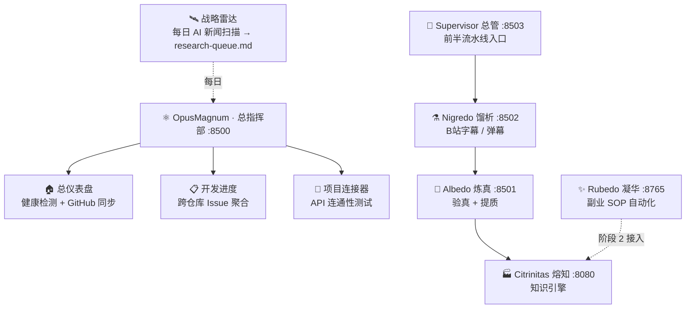

# ⚛️ OpusMagnum · 巨作

> 一人公司的 AI 炼金术总指挥部——把「学别人」到「赚到钱」拧成一条可拆、可卖的自动流水线。

[](https://github.com/shiyao222333-afk/opus-magnum)


[](https://github.com/shiyao222333-afk/opus-magnum)

---

## 🤔 为什么需要总指挥部？

一人公司最怕的不是没工具，而是工具散、进度盲、知识断。巨作把四件兵器用最轻的方式拧成一条线：

| 散装四器自己跑 | 用巨作总指挥部 |
|------|------|
| 四个仓库来回切看进度 | 一屏看全部 Issue / Stars / 在线状态 |
| 贴链接后要手动一步步跑 | 总管一键跑完「采 → 验 → 存」 |
| 不知道每天 AI 圈有什么新机会 | 战略雷达每日自动扫，分级进研究队列 |
| 各器端口 / 启动各记各的 | 统一端口表 + 一键启动 |
| 知识真伪靠自己盯 | 炼真把关 + 熔知标「可疑 / 虚假」 |
| 攒了一堆却连不成闭环 | 模仿飞轮：采→验→存→赚→回流 |

---

## ✨ 项目亮点

1. **统一仪表盘** — 各器在线状态、GitHub Issues / Stars / Forks / 最后提交一屏可见。
2. **跨仓库 Issue 聚合** — 在 GitHub 建 / 关 Issue，巨作自动同步，不用四仓库来回切。
3. **项目连接器** — 手动测试各器 API 是否打通（健康检测 / 搜知识库 / 投视频 / 触发精炼）。
4. **战略雷达自动化** — 每日 AI 新闻扫描 → 四层过滤 → 按优先级写入 `research-queue.md`。
5. **前半流水线 Supervisor** — 贴一个 B站 链接，界面点「开始」即自动跑完「下载字幕 → 炼真出鉴定报告 → 丢进熔知入库」。
6. **五器可拆可卖** — 整合只加一层轻量传送带，每个器仍是独立仓库、独立可跑、独立可卖，随时能拆走。

---

## ⚔️ 核心能力 & 方案对比

| 对比维度 | 巨作 OpusMagnum | Obsidian 生态 | Notion AI | 自写脚本拼接 |
|---|:--:|:--:|:--:|:--:|
| 端到端闭环（采→验→存→赚） | ✅ | ~ | ~ | ~ |
| 五器分工、可拆可单独卖 | ✅ | — | — | — |
| 统一仪表盘 + 跨仓库 Issue 聚合 | ✅ | — | ~ | — |
| 知识入库前真伪把关（炼真） | ✅ | — | — | ~ |
| 战略雷达每日自动扫描情报 | ✅ | — | — | ~ |
| B站 / 视频原生摄入（馏析） | ✅ | — | — | ~ |
| 副业 SOP 自动化（凝华） | ✅ | — | ~ | ~ |
| 全本地 / 自托管 | ✅ | ✅ | ~ | ✅ |
| 开源但核心闭源可收费 | ✅ | — | — | — |
| 通用笔记 / 文档管理 | ~ | ✅ | ✅ | ~ |
| 多平台分发自动化（规模期） | 🔮 | — | ~ | ~ |
| 跨源矛盾检测（规模期） | 🔮 | — | — | ~ |
| **核心定位 / 各有千秋** | 一人公司从「学别人」到「赚到钱」的完整闭环 + 可拆可卖的五器工坊，不是又一个笔记软件 | 强大但需自己拼 | 便利但闭环弱、数据在外 | 灵活但维护重 |

> 图例：✅ 有 ／ ~ 部分 ／ 🔮 规划中 ／ — 无。

---

## 🔄 巨作如何编排四器



---

## 🏗️ 架构概览


| 层 | 目录 | 职责 |
|------|------|------|
| 视图层 | `pages/` | Streamlit 多页 UI（仪表盘 / 进度 / 连接器） |
| 核心层 | `core/` | GitHub 客户端、健康检测、项目连接器、数据聚合 |
| 编排层 | `front_half/supervisor/` | 前半流水线编排（贴链接 → 馏析 → 炼真 → 熔知） |
| 四器联接 | `front_half/{nigredo,albedo,citrinitas}` + 目录联接 | 指向真实仓库，统一传送 |

---

## 📁 目录结构

```
opus-magnum/
├── BLUEPRINT.md            # 项目宪法（一人公司愿景 + 五器工坊）
├── FLOWCHART.md            # 流程框图（总指挥部数据流 Mermaid 图）
├── README.md               # 本文件
├── PROJECT_PLAN.md         # 详细路线图（阶段 0–4）
├── CHANGELOG.md            # 版本变更记录（Keep a Changelog）
├── api_spec.md             # 项目间通信规范（核心文档）
├── .env.example            # 环境变量模板（复制为 .env 使用）
├── .gitignore
├── requirements.txt
├── run.bat                 # 总指挥部启动（:8500）
├── app.py                  # Streamlit 主入口
├── config/
│   └── settings.py         # 全局配置（五器地址、API Key）
├── core/                   # 核心逻辑层
│   ├── github_client.py     # GitHub REST 客户端（无 PyGithub / LGPL）
│   ├── health_check.py      # 服务健康检测（熔知 8080 NiceGUI）
│   ├── project_hub.py       # 项目连接器客户端
│   └── dashboard.py         # 仪表盘数据聚合
├── pages/                  # Streamlit 多页 UI
│   ├── 1_🏠_总仪表盘.py
│   ├── 2_📋_开发进度.py
│   └── 3_🔗_项目连接器.py
├── front_half/             # 前半部分整合
│   ├── launch.bat          # 总启动器（先起熔知 → 起总管）
│   ├── supervisor/         # 前半流水线编排（NiceGUI :8503）
│   ├── nigredo/            # 目录联接 → D:\nigredo
│   ├── albedo/             # 目录联接 → D:\albedo
│   └── citrinitas/         # 目录联接 → D:\citrinitas
├── schemas/                # 统一数据模型（5 个 JSON Schema）
├── workflow/               # 📐 项目管理流程 v4.0
├── docs/                   # 审计 / 研究 / 模板 / 端口表
│   └── PORTS.md            # 统一端口分配
├── strategy/               # 一人公司战略白皮书
├── assets/                 # logo 等
└── utils/
    └── ui_utils.py         # 侧边栏、CSS 注入
```

---

## 🛠️ 技术栈

| 层 | 技术 | 授权 / 理由 |
|---|------|------|
| 前端（总指挥部）| **Streamlit** | 快速迭代，持续可用 |
| 前端（总管）| **NiceGUI** | SPA 流水线界面 |
| 数据 | **pandas** | 表格展示 |
| 外部 API | **requests（GitHub REST API）** | 读 Issues，无 PyGithub（LGPL） |
| 项目间调用 | **requests** | HTTP REST 客户端 |
| 启动 | Windows `run.bat` / `launch.bat` | 一键启动 |

> **注**：熔知已从 Streamlit 迁移到 NiceGUI（SPA），巨作自身仍保持 Streamlit；总管 Supervisor 用 NiceGUI。

---

## 🗺️ 路线图

| 阶段 | 一句话目标 | 关键交付 | 状态 |
|------|-----------|---------|:--:|
| **阶段 0** | 把独立项目用最轻方式绑成能统一管理的整体 | M0 整合骨架 | ✅ 完成 |
| **阶段 1** | 贴链接自动跑完全程：采→验→存 | M1–M4 | 🔴 进行中 |
| **阶段 2** | 把「知识→赚钱」后半截并进来统一管理 | 凝华接入 + 全链路看板 | ⚪ 待命 |
| **阶段 3** | 落实「大部分开源、核心收费」 | 物理隔离 + 激活码 + 分层 | ⚪ 待命 |
| **阶段 4** | 战略雷达调优 + 护城河能力 | 矛盾检测 / 关系网 / 多平台分发 | 🟡 持续 |

> 详细计划见 [PROJECT_PLAN.md](PROJECT_PLAN.md)。

---

## ⚡ 快速开始

### 1. 克隆项目

```bash
git clone https://github.com/shiyao222333-afk/opus-magnum.git
cd opus-magnum
```

### 2. 安装依赖

```bash
python -m venv venv
venv\Scripts\activate      # Windows
pip install -r requirements.txt
```

### 3. 配置环境变量

复制 `.env.example` 为 `.env`，填写你的 GitHub Token（只需要 **read 权限**）：

```bash
# .env
GITHUB_TOKEN=ghp_xxxxxxxxxx
```

> ⚠️ 如果暂时没有 Token，仪表盘仍能工作，只是无法读取 GitHub Issues。

### 4. 启动总指挥部（Windows）

```bash
.\run.bat
```

访问 [http://localhost:8500](http://localhost:8500)

### 5. 跑前半流水线（可选）

前半流水线依赖「熔知收件箱在监听」，所以先起熔知，再起总管：

```bash
# 终端一：先起熔知
D:\citrinitas\run.bat

# 终端二：再起总管（贴 B站 链接一键跑流水线）
D:\opus-magnum\front_half\launch.bat
```

> 统一端口分配见 [docs/PORTS.md](docs/PORTS.md)。所有服务均监听 `127.0.0.1`（本机）。

---

## 👤 适合谁用

| 适合 | 不适合 |
|------|--------|
| 一人公司 / 副业者 | 多人团队 |
| 想「学别人 → 赚到钱」闭环的人 | 只想存笔记的纯消费者 |
| 内容创作者 / 自学者 | 不想碰本地部署的小白 |
| 想自己拼 AI 工具链的开发者 | 要 SaaS 托管服务的人 |

---

## ❓ 常见问题

**Q1：五器一定要全用吗？**
不必。每个器都是独立仓库、独立可跑、独立可卖；巨作目前只把「前半」（采→验→存）串起来，凝华（赚）等阶段 2 再接入。

**Q2：端口冲突怎么办？**
固定端口表见 [docs/PORTS.md](docs/PORTS.md)，全部监听 `127.0.0.1`，互不冲突。

**Q3：战略雷达能关吗？**
能。它是 WorkBuddy 里的自动化任务，暂停即可，不影响其他功能。

**Q4：巨作本身卖吗？**
巨作 MIT 开源供参考；核心收费模块（跨源矛盾检测 / 知识关系网 / 高级语义搜索）走阶段 3 物理隔离闭源。

**Q5：为什么不用 Docker？**
单人本机，`run.bat` 足够；未来商业化再考虑容器化。

---

## 🤝 贡献

欢迎提 Issue / PR。所有开发统一使用 [项目管理流程 v4.0](workflow/BLUEPRINT.md)——每次任务前读蓝图对齐，每步做完自审，改完翻译回自然语言。

## 📄 许可证

MIT License —— 自由使用、修改、分发。核心收费模块（阶段 3）将采用独立商业 EULA，物理隔离在 `core/premium/`。

## 🙏 致谢

- **Vikunja**：开源自托管任务管理（多视图、API-first）
- **Building a Second Brain**（Tiago Forte）：知识 / 任务组织方法论
- **The Personal MBA**（Josh Kaufman）：一人企业系统思维

---

*Build in public. Think in private. Ship relentlessly.*
