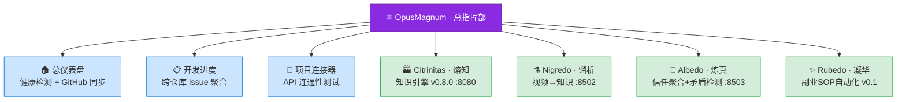

# ⚛️ OpusMagnum · 巨作 / GreatWork

> 一人公司的 AI 炼金术总指挥部

[](https://github.com/shiyao222333-afk/opus-magnum)


[](https://github.com/shiyao222333-afk/opus-magnum)

---

## 这是什么

**OpusMagnum**（巨作）是一人公司 AI 工具链的**总指挥部**。

它不重复各子项目的功能，而是**连接、聚合、调度**：



---

## 一人公司蓝图

| 项目 | Emoji | 功能 | GitHub | 本地路径 | 状态 |
|------|-------|------|--------|----------|:--:|
| **OpusMagnum** | ⚛️ | 总指挥部（本仓库）| [shiyao222333-afk/opus-magnum](https://github.com/shiyao222333-afk/opus-magnum) | `D:\opus-magnum\` | 🚧 |
| **Workflow** | 📐 | 项目管理流程（方法论）| [workflow/](workflow/) | `~/.workbuddy/skills/` | ✅ v3.1 |
| **Citrinitas · 熔知** | 🏭 | 知识引擎 | [shiyao222333-afk/citrinitas](https://github.com/shiyao222333-afk/citrinitas) | `D:\citrinitas\` | ✅ v0.8.0 |
| **Nigredo · 馏析** | ⚗️ | 视频→知识提炼 | [shiyao222333-afk/nigredo](https://github.com/shiyao222333-afk/nigredo) | `D:\nigredo\` | 🚧 |
| **Albedo · 炼真** | 🔬 | 信任聚合 + 跨源矛盾检测 | [shiyao222333-afk/albedo](https://github.com/shiyao222333-afk/albedo) | `D:\albedo\` | 🔮 |
| **Rubedo · 凝华** | ✨ | AI辅助副业SOP自动化平台（共用工具层 + SOP独特工具层） | [shiyao222333-afk/rubedo](https://github.com/shiyao222333-afk/rubedo) | `D:\rubedo\` | 🚧 v0.1 |

> 完整蓝图见 [BLUEPRINT.md](BLUEPRINT.md)
> 项目管理流程见 [workflow/](workflow/)
> 一人公司战略见 [strategy/vision.md](strategy/vision.md)

---

## 项目管理流程 (Workflow v3.1)

OpusMagnum 所有子项目统一使用一套**标准化项目管理流程**：

```
用户指令 → Pre-flight → Phase 0(意图分类) → Phase 0.1(蓝图对齐) → Phase 0.5(代码探索)
         → Phase 1(计划拆解+节点映射) → Phase 1.5(方案讨论+节点契约) → Phase 2(执行+防偏)
         → Phase 2.5(自审) → Phase 3(L1→L4验证) → Phase 4(文档+蓝图反哺) → Phase 5(归档)
```

核心特点：
- **蓝图先行** — 每个项目有 BLUEPRINT.md（宪法）+ FLOWCHART.md（数据流）
- **节点映射** — 每个任务必须标注 📍节点ID，找不到节点 → 红牌警告
- **MVP 优先** — Phase 1.5 审查：有更简单的方式吗？
- **防偏检查** — Phase 2 每个任务执行前检查：服务于当前重心？
- **技术债追踪** — 跳过的非 MVP 项记入 TECH_DEBT.md（不丢）
- **蓝图反哺** — Phase 4 结束后反思：重心缓解了？新认知？

> 详细文档：[workflow/BLUEPRINT.md](workflow/BLUEPRINT.md) · [workflow/FLOWCHART.md](workflow/FLOWCHART.md)

---

## 快速启动

### 1. 克隆项目

```bash
git clone https://github.com/shiyao222333-afk/opus-magnum.git
cd opus-magnum
```

### 2. 安装依赖

```bash
python -m venv venv
venv\Scripts\activate      # Windows
pip install -r requirements.txt
```

### 3. 配置环境变量

复制 `.env.example` 为 `.env`，填写你的 GitHub Token（只需要 **read 权限**）：

```bash
# .env
GITHUB_TOKEN=ghp_xxxxxxxxxx
```

> ⚠️ 如果暂时没有 Token，仪表盘仍能工作，只是无法读取 GitHub Issues。

### 4. 一键启动（Windows）

```bash
.\run.bat
```

### 5. 打开浏览器

访问 [http://localhost:8500](http://localhost:8500)

---

## 功能说明

### 🏠 总仪表盘

打开首页即可看到：
- 各子项目**是否在线**（自动 ping `/health` 端点）
- 各 GitHub 仓库的 **Issues 数 / Stars / Forks / 最后提交**
- 当前配置连接的所有子项目状态一览

### 📋 开发进度

集中查看所有项目的任务，不用去四个仓库来回切。

在 GitHub 建 Issue → OpusMagnum 自动显示 → 在 GitHub 关 Issue → OpusMagnum 自动更新

### 🔗 项目连接器

手动测试各项目 API 是否打通：
- Ping 各项目健康检查端点
- 搜索 Citrinitas 知识库
- 提交视频给 Nigredo 处理
- 触发 Albedo 矛盾检测

---

## 项目间通信规范

各子项目按 `api_spec.md` 定义的规范实现 REST API，OpusMagnum 按此规范调用。

**核心原则**：
- 统一认证：`X-Api-Key` 请求头
- 统一数据格式：JSON，符合 `schemas/` 目录下的 Schema
- 统一端口分配：Citrinitas 8080 (NiceGUI) / Nigredo 8502 / Albedo 8503 / OpusMagnum 8500

---

## 目录结构

```
opus-magnum/
├── BLUEPRINT.md            # 项目宪法（一人公司愿景+五器工坊）
├── FLOWCHART.md            # 流程框图（总指挥部数据流 Mermaid 图）
├── README.md               # 本文件
├── .env.example            # 环境变量模板（复制为 .env 使用）
├── api_spec.md             # 项目间通信规范（核心文档）
├── workflow/               # 📐 项目管理流程
│   ├── BLUEPRINT.md        #   流程宪法
│   └── FLOWCHART.md        #   流程架构图（Mermaid）
├── schemas/                # 统一数据模型（5 个 JSON Schema）
│   ├── document.schema.json      # 文档格式
│   ├── video_meta.schema.json   # 视频元数据
│   ├── claim.schema.json        # 声明结构
│   ├── contradiction_report.schema.json  # 矛盾报告
│   └── task.schema.json        # 跨项目任务
├── app.py                   # Streamlit 主入口（端口 8500）
├── config/
│   └── settings.py         # 全局配置（项目地址、API Key）
├── core/                    # 核心逻辑层
│   ├── github_client.py     # GitHub API 封装
│   ├── health_check.py      # 服务健康检测（Athanor 8080 NiceGUI）
│   ├── project_hub.py      # 项目连接器客户端
│   └── dashboard.py        # 仪表盘数据聚合
├── pages/                   # Streamlit 多页 UI
│   ├── 1_🏠_总仪表盘.py
│   ├── 2_📋_开发进度.py
│   └── 3_🔗_项目连接器.py
├── utils/
│   └── ui_utils.py        # 侧边栏、CSS 注入
└── requirements.txt
```

---

## 技术栈

| 层 | 技术 | 理由 |
|---|------|------|
| 前端 | **Streamlit** | 快速迭代，持续可用 |
| 数据 | **pandas** | 表格展示 |
| 外部 API | **PyGithub** | 读取 GitHub Issues |
| 项目间调用 | **requests** | HTTP REST 客户端 |

> **注**: Citrinitas 已从 Streamlit 迁移到 NiceGUI 3.13 (SPA)，OpusMagnum 自身仍保持 Streamlit。

---

## 参考资料

本项目设计过程中参考了以下工具/理念：
- **Vikunja**：开源自托管任务管理（多视图、API-first）
- **Building a Second Brain**（Tiago Forte）：知识/任务组织方法论
- **The Personal MBA**（Josh Kaufman）：一人企业系统思维

---

## 许可证

MIT License —— 自由使用、修改、分发。

---

*Build in public. Think in private. Ship relentlessly.*
