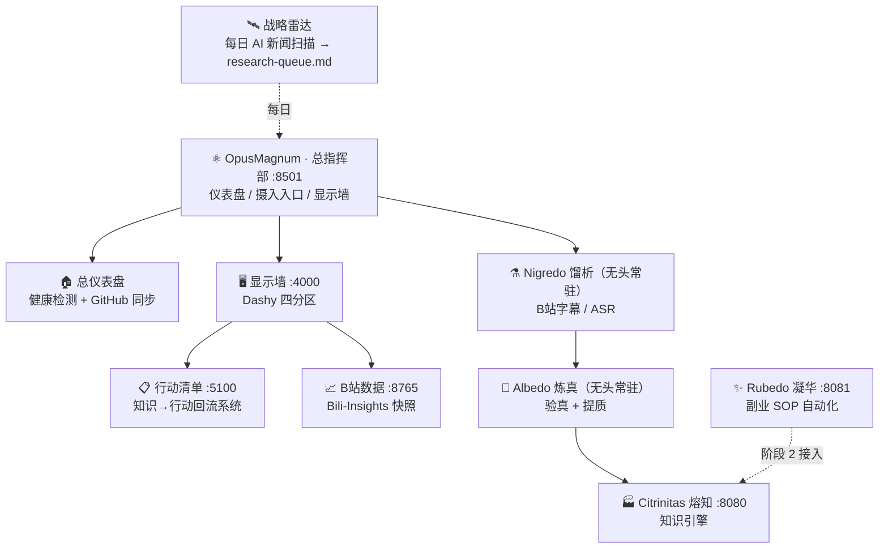

# ⚛️ OpusMagnum · 巨作

> 一人公司的 AI 炼金术总指挥部——把「学别人」到「赚到钱」拧成一条可拆、可卖的自动流水线，并统一管理五器 + 显示墙。

[](https://github.com/shiyao222333-afk/opus-magnum)


[](https://github.com/shiyao222333-afk/opus-magnum)

---

## 🤔 为什么需要总指挥部？

一人公司最怕的不是没工具，而是工具散、进度盲、知识断。巨作把四件兵器用最轻的方式拧成一条线：

| 散装四器自己跑 | 用巨作总指挥部 |
|------|------|
| 四个仓库来回切看进度 | 一屏看全部 Issue / Stars / 在线状态 |
| 贴链接后要手动一步步跑 | 总管一键跑完「采 → 验 → 存」 |
| 不知道每天 AI 圈有什么新机会 | 战略雷达每日自动扫，分级进研究队列 |
| 各器端口 / 启动各记各的 | 统一端口表 + 托盘启动器一键拉起 6+ 服务 |
| 知识真伪靠自己盯 | 炼真把关 + 熔知标「可疑 / 虚假」 |
| 攒了一堆却连不成闭环 | 模仿飞轮：采→验→存→赚→回流 |
| 知识收了不知道下一步干啥 | 显示墙 + 行动清单：每周告诉你该做什么 |

---

## ✨ 项目亮点

1. **托盘启动器（一键启停）** — 双击 `launcher\启动巨作.bat` 即出托盘图标 + 启动巨作（其余服务按需经托盘右键菜单启停；单例锁防多实例互殴），隐藏窗口、定时探活、死了自动重启、启前清理过期锁与端口，接管旧实例。
2. **统一仪表盘** — 各器在线状态、GitHub Issues / Stars / Forks / 最后提交一屏可见。
3. **摄入入口一键跑流水线** — 在巨作「📥 摄入入口」贴一个 B站 链接 / 上传文件 / 写笔记，即自动跑完「下载字幕 → 炼真出鉴定报告 → 丢进熔知入库」，全链路实测跑通（含收藏夹批量导入 20 条）。
4. **显示墙（Dashy）** — 工具总集合页：🔗 工具入口 / 📚 研究报告 / 📋 行动清单 / 📈 B站数据 四分区，workspace 内嵌，巨作「🖥️ 显示墙」子页面直连。
5. **知识→行动回流系统** — 每周把知识库新内容按目标（goals.md）提炼成行动清单（📋 5100），防重复提炼、高播放🔥标注、归档内容检索排除，显示墙上直接看。
6. **战略雷达自动化** — 每日 AI 新闻扫描 → 四层过滤 → 按优先级写入 `research-queue.md`。
7. **五器可拆可卖** — 整合只加一层轻量传送带，每个器仍是独立仓库、独立可跑、独立可卖，随时能拆走。

---

## 🎯 核心能力 & 方案对比

| 对比维度 | 巨作 OpusMagnum | Obsidian 生态 | Notion AI | 自写脚本拼接 |
|---|:--:|:--:|:--:|:--:|
| 端到端闭环（采→验→存→赚） | ✅ | ~ | ~ | ~ |
| 五器分工、可拆可单独卖 | ✅ | — | — | — |
| 统一仪表盘 + 跨仓库 Issue 聚合 | ✅ | — | ~ | — |
| 托盘启动器（一键启停 + 自愈） | ✅ | — | — | — |
| 知识入库前真伪把关（炼真） | ✅ | — | — | ~ |
| 战略雷达每日自动扫描情报 | ✅ | — | — | ~ |
| B站 / 视频原生摄入（馏析） | ✅ | — | — | ~ |
| 显示墙 + 行动清单（知识→行动） | ✅ | — | — | ~ |
| 副业 SOP 自动化（凝华） | ✅ | — | ~ | ~ |
| 全本地 / 自托管 | ✅ | ✅ | ~ | ✅ |
| 开源但核心闭源可收费 | ✅ | — | — | — |
| 通用笔记 / 文档管理 | ~ | ✅ | ✅ | ~ |
| 多平台分发自动化（规模期） | 🔮 | — | ~ | ~ |
| 跨源矛盾检测（规模期） | 🔮 | — | — | ~ |
| **核心定位 / 各有千秋** | 一人公司从「学别人」到「赚到钱」的完整闭环 + 可拆可卖的五器工坊，不是又一个笔记软件 | 强大但需自己拼 | 便利但闭环弱、数据在外 | 灵活但维护重 |

> 图例：✅ 有 ／ ~ 部分 ／ 🔮 规划中 ／ — 无。

---

## 🏗️ 架构


```mermaid
flowchart TB
    Radar["🛰️ 战略雷达<br/>每日 AI 新闻扫描 → research-queue.md"]
    OM["⚛️ OpusMagnum · 总指挥部 :8501<br/>仪表盘 / 摄入入口 / 显示墙"]
    Dash["🏠 总仪表盘<br/>健康检测 + GitHub 同步"]
    Wall["🖥️ 显示墙 :4000<br/>Dashy 四分区"]
    Act["📋 行动清单 :5100<br/>知识→行动回流系统"]
    Bili["📈 B站数据 :8765<br/>Bili-Insights 快照"]
    N["⚗️ Nigredo 馏析（无头常驻）<br/>B站字幕 / ASR"]
    A["🔬 Albedo 炼真（无头常驻）<br/>验真 + 提质"]
    C["🏭 Citrinitas 熔知 :8080<br/>知识引擎"]
    R["✨ Rubedo 凝华 :8081<br/>副业 SOP 自动化"]

    OM --> Dash & Wall
    Wall --> Act & Bili
    Radar -.每日.-> OM
    OM --> N --> A --> C
    R -.阶段 2 接入.-> C
```

| 层 | 目录 | 职责 |
|------|------|------|
| 视图层 | `app.py` | NiceGUI 单页（周看板 / 摄入入口 / 显示墙 / 总指挥部） |
| 核心层 | `core/` | GitHub 客户端、健康检测、项目连接器、数据聚合 |
| 编排层 | `front_half/` | 投递路由 ingest_router（贴链接 → 馏析 → 炼真 → 熔知） |
| 启动层 | `launcher/` | 托盘启动器 + 总管 supervisor（services.py 托管 8 个服务） |
| 显示墙 | `wall/` | Dashy（4000）+ Bili-Insights（8765）+ 行动清单（5100） |
| 四器联接 | `front_half/{nigredo,albedo,citrinitas}` | 目录联接指向真实仓库，统一传送 |

---

## 🚀 快速开始

```bash
# 1. 克隆 + 安装依赖（首次）
git clone https://github.com/shiyao222333-afk/opus-magnum.git
cd opus-magnum
python -m venv venv
venv\Scripts\activate
pip install -r requirements.txt

# 2. 配置环境变量（GitHub Token 只需 read 权限；没有也能用，只是仪表盘读不到 Issues）
cp .env.example .env

# 3. 一键启动（推荐）——托盘启动器（出托盘图标 + 启动巨作，其余服务托盘右键按需开）
双击 launcher\启动巨作.bat   # 或：python launcher/launcher.pyw

# 4. 打开浏览器
#    总指挥部 http://localhost:8501
#    显示墙    http://localhost:4000
#    行动清单  http://localhost:5100
```

**单独启动**：`.\run.bat` 只起巨作本身（需先起熔知 `D:\citrinitas\run.bat`）。

> 统一端口分配见 [docs/PORTS.md](docs/PORTS.md)。所有服务均监听 `127.0.0.1`（本机）。

---

## 📖 使用说明

**① 摄入 B站视频（核心流程）**：打开巨作「📥 摄入入口」→ 贴 B站链接 → 点提交 → 自动跑完「馏析下载+ASR → 炼真精炼 → 熔知切块入库 Qdrant」→ 显示墙上看到新文档。
**② 看显示墙**：巨作 →「🖥️ 显示墙」子页面（或直接 localhost:4000）→ Dashy 四分区：工具入口 / B站数据 / 研究报告 / 行动清单。
**③ 每周行动清单**：对 AI 说一句「更新行动清单」→ 扫描知识库新内容 → 按目标提炼成行动（每周一份，模板固定只换内容）→ 行动清单页自动显示新版。
**④ 统一启停**：托盘图标右键 → 查看/重启各服务；服务死了总管自动拉起。

---

## 📂 目录结构

```
opus-magnum/
├── BLUEPRINT.md            # 项目宪法（一人公司愿景 + 五器工坊）
├── FLOWCHART.md            # 流程框图（总指挥部数据流 Mermaid 图）
├── README.md               # 本文件
├── PROJECT_PLAN.md         # 详细路线图（阶段 0–4）
├── CHANGELOG.md            # 版本变更记录（Keep a Changelog）
├── api_spec.md             # 项目间通信规范（核心文档）
├── research-queue.md       # 战略雷达产出（AI 新闻分级队列）
├── .env.example / .gitignore / requirements.txt
├── run.bat                 # 巨作单独启动（:8501）
├── launcher/启动巨作.bat    # 托盘启动器一键启停（推荐，双击出托盘+起巨作）
├── app.py                  # NiceGUI 主入口（周看板 / 摄入入口 / 显示墙 / 总指挥部）
├── config/settings.py      # 全局配置（五器地址、API Key）
├── core/                   # 核心逻辑（github_client / health_check / project_hub / dashboard）
├── front_half/             # 前半部分整合（ingest_router + nigredo/albedo/citrinitas 联接）
├── launcher/               # 🆕 托盘启动器 + 总管（services.py 托管 8 服务 + supervisor 自愈）
├── wall/                   # 🆕 显示墙（dashy 4000 / bili-insights 8765 / action-flow 5100）
├── schemas/                # 统一数据模型（5 个 JSON Schema）
├── workflow/               # 📐 项目管理流程 v4.0
├── docs/                   # 审计 / 研究 / 模板（README-TEMPLATE.md）/ 端口表
├── strategy/               # 一人公司战略白皮书
└── assets/                 # logo 等
```

---

## 🧰 技术栈

| 用途 | 技术 | 授权 / 说明 |
|------|------|------|
| 前端（总指挥部） | NiceGUI | MIT（SPA：周看板 / 摄入入口 / 显示墙） |
| 显示墙 | Dashy | MIT（自托管仪表盘，node.exe 托管） |
| B站数据 | Bili-Insights | 开源快照工具（含本机 Cookie 配置，不入库） |
| 数据 / 表格 | pandas | BSD |
| GitHub 接口 | requests（REST API） | 无 PyGithub（LGPL） |
| 托盘 / 总管 | pystray + psutil | MIT |
| 启动 | Windows `.bat` / `pythonw` | 隐藏窗口 + 自愈 |

> **注**：馏析 / 炼真改为无头常驻（无 Web 端口）；原 Streamlit 网页与独立 Supervisor(:8503) 已退役。

---

## 🗺️ 路线图

| 阶段 | 一句话目标 | 关键交付 | 状态 |
|------|-----------|---------|:--:|
| **阶段 0** | 把独立项目用最轻方式绑成能统一管理的整体 | M0 整合骨架 | ✅ 完成 |
| **阶段 1** | 贴链接自动跑完全程：采→验→存 | 摄入管线全链路实测 + 20 条收藏夹批量导入 | ✅ 基本完成 |
| **阶段 2** | 知识消费侧：显示墙 + 知识→行动回流 | Dashy / B站数据 / 行动清单 5100 已上线 | 🔴 进行中 |
| **阶段 3** | 落实「大部分开源、核心收费」 | 物理隔离 + 激活码 + 分层 | ⚪ 待命 |
| **阶段 4** | 战略雷达调优 + 护城河能力 | 矛盾检测 / 关系网 / 多平台分发 | 🟡 持续 |

> 详细计划见 [PROJECT_PLAN.md](PROJECT_PLAN.md)。

---

## 📚 文档导航

- 📜 项目宪法：[BLUEPRINT.md](BLUEPRINT.md)
- 🗺️ 开发路线：[PROJECT_PLAN.md](PROJECT_PLAN.md)
- 🔧 流程框图：[FLOWCHART.md](FLOWCHART.md)
- 📄 端口分配：[docs/PORTS.md](docs/PORTS.md)
- 📐 项目间通信规范：[api_spec.md](api_spec.md)
- 📋 显示墙方案：[wall/显示墙方案.md](wall/显示墙方案.md)
- 📋 知识→行动系统：[wall/知识行动系统-调研与设计.md](wall/知识行动系统-调研与设计.md)

---

## 👤 适合谁用

| 适合 | 不适合 |
|------|--------|
| 一人公司 / 副业者 | 多人团队 |
| 想「学别人 → 赚到钱」闭环的人 | 只想存笔记的纯消费者 |
| 内容创作者 / 自学者 | 不想碰本地部署的小白 |
| 想自己拼 AI 工具链的开发者 | 要 SaaS 托管服务的人 |

---

## ❓ 常见问题

**Q1：五器一定要全用吗？**
不必。每个器都是独立仓库、独立可跑、独立可卖；巨作目前把「采→验→存」串起来 + 显示墙，凝华（赚）阶段 2 接入。

**Q2：端口冲突怎么办？**
固定端口表见 [docs/PORTS.md](docs/PORTS.md)，全部监听 `127.0.0.1`；托盘启动器启前会自动清理旧端口，不怕残留实例。

**Q3：战略雷达能关吗？**
能。它是 WorkBuddy 里的自动化任务，暂停即可，不影响其他功能。

**Q4：巨作本身卖吗？**
巨作 MIT 开源供参考；核心收费模块（跨源矛盾检测 / 知识关系网 / 高级语义搜索）走阶段 3 物理隔离闭源。

**Q5：为什么不用 Docker？**
单人本机，`启动巨作.bat` 足够；未来商业化再考虑容器化。

---

## 🤝 贡献 & 许可证

- **许可证**：MIT License —— 自由使用、修改、分发。核心收费模块（阶段 3）将采用独立商业 EULA，物理隔离在 `core/premium/`。
- **参与方式**：欢迎提 Issue / PR。所有开发统一使用 [项目管理流程 v4.0](workflow/BLUEPRINT.md)——每次任务前读蓝图对齐，每步做完自审，改完翻译回自然语言。

## 🙏 致谢

- **Vikunja**：开源自托管任务管理（多视图、API-first）
- **Building a Second Brain**（Tiago Forte）：知识 / 任务组织方法论
- **The Personal MBA**（Josh Kaufman）：一人企业系统思维
- **Dashy**：自托管仪表盘显示墙

---

*本文件遵循 `docs/README-TEMPLATE.md` 标准结构生成。*
