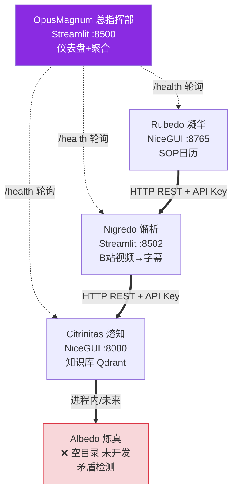
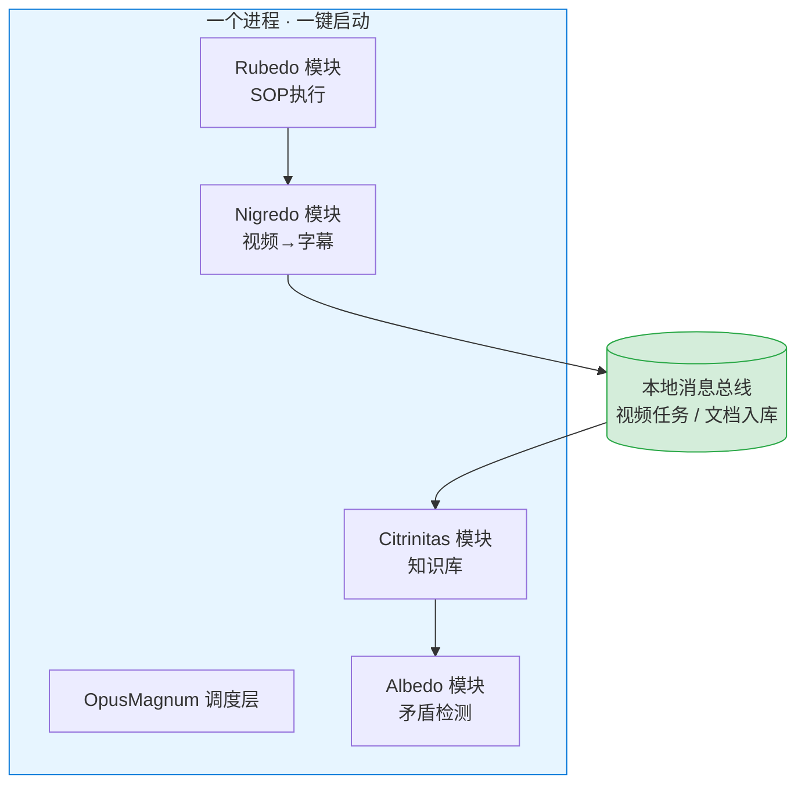

# Opus Magnum 系统架构评审

> 评审日期：2026-07-08 ｜ 评审人：软件架构师（架构通）
> 背景：用户要求"设计可扩展系统架构，看现在结构是否合理"
> 范围：五器工坊整体（OpusMagnum / Nigredo / Albedo / Citrinitas / Rubedo）

---

## 一句话结论

**"五器分工"的领域拆分是对的，但你现在把它当"分布式微服务"在设计，对单人单机来说属于过度设计。**

你付了分布式的复杂度（API Key、健康检查链、5 个端口、编排），却用不上分布式的任何好处（横向扩容、独立部署、多团队）。

**建议**：保留五个清晰的边界，但**把它们当作"一个软件里的五个模块"来集成**；等 Nigredo 真要卖给别人（跑在别的机器上）时，再把它单独拆成服务。架构要"可演进"，不要"现在就分布式"。

---

## 现在的结构（你目前的真实样子）



**关键事实（已核实）**：
- 5 个项目 = 5 个独立进程，各自 `run.bat` 手动启动
- 进程间用 HTTP REST + `X-Api-Key: opus-magnum-local` 互调（api_spec.md 定义）
- Albedo 目录为空 —— 矛盾检测这一环目前不存在
- 命名分裂（已修正）：api_spec 曾用 Athanor/Alembic/Crucible/Elixir，蓝图用 Citrinitas/Nigredo/Albedo/Rubedo；现已统一为两段式（阶段名 + 英文功能名 Alembic/Crucible/Athanor/Aludel），Rubedo 端口 api_spec 原写 8504，已修正为 8765

---

## 哪里合理（请保留，这是好架构）

| # | 优点 | 为什么好 |
|---|------|---------|
| 1 | **五器 = 五个有边界的上下文** | 完全对应 DDD 的 bounded context：采集 / 存储 / 校验 / 执行 / 调度，上下游关系清楚（Nigredo→Citrinitas→Albedo→Rubedo）。这个拆分本身就是对的 |
| 2 | **每个蓝图都写"不做什么"** | Nigredo"不做知识存储"、Rubedo"采集交给 Nigredo"——边界纪律好，防止功能乱串 |
| 3 | **有 schema 契约意识** | `schemas/` 下有 document / contradiction_report / video_meta 等 5 个契约文件，说明你想到了集成接口要规范 |

**结论**：领域建模这步你做对了，不用推翻。

---

## 哪里有坑（当前结构的问题）

| 问题 | 通俗解释 | 实际后果 |
|------|---------|---------|
| **本机服务间加 API Key** | 你给自己家客厅装一把要钥匙的锁 | 没用的复杂度；任意一处 key 没配对，整条链路断掉 |
| **5 个 run.bat 手动起** | 要同时扳 5 个开关机器才转 | 蓝图验收标准①"一句话触发"做不到——上游没开，下游直接崩 |
| **命名 / 端口漂移** | 一份文档叫它小名，另一份叫它大名；门牌号还写错 | 真对接时必出 bug，且难查 |
| **Albedo 还是空的** | 你说这是"护城河"，但它现在不存在 | 流水线中间缺一环，Nigredo→Citrinitas 直接跳过校验 |
| **schema 没人强制用** | 契约写好了，但各项目各存各的 | 上游推的格式，下游可能接不住 |

**最危险的不是某个 bug，而是"为不存在的规模提前买单"**——你现在写的分布式设施，单人单机上永远用不上，反而天天增加出故障的概率。

---

## 推荐架构：模块化单体 + 异步总线

把五个边界保留为**同一进程里的五个模块**，天然异步的环节（Nigredo 处理视频 → Citrinitas 入库）用**本地消息**（文件或轻量队列）解耦，不跨网络。



**好处**：
- 去掉本机 API Key 剧场、5 端口、健康检查链
- 一个启动器全起，蓝图"一句话触发"可实现
- 部署原子化（要么全活要么全死，不会半死不活让你猜哪个挂了）
- 模块间调用 = 函数调用，零延迟零故障面

**代价（你要放弃的）**：不能独立横向扩容——但你是单人，永远用不上。

---

## ADR-001：项目间集成方式

```markdown
# ADR-001: 项目间集成方式

## Status
Proposed（待你确认）

## Context
五器工坊目前全在一台 Windows 上、单人使用。api_spec.md 已规划用 HTTP REST + API Key
在它们之间互调，并设计了健康检查轮询和回调链。但单机单用户下，这些是分布式系统的
成本，却换不来分布式的收益。

## Decision
- 默认：五个上下文作为【同一进程内的模块】集成，互相直接调用
- 异步环节（Nigredo→Citrinitas 这种"丢任务、稍后取结果"）：用【本地消息】解耦
- 仅当 Nigredo 真正产品化（卖给别人、部署到别的机器）时，才把它拆成【独立 HTTP 服务 + 真认证】

## Consequences
+ 去除本机 API Key 剧场、端口 sprawl、健康检查脆弱链
+ 单一启动器即可跑全线，验收标准①"一句话触发"可行
+ 部署原子，排错简单
- 不能独立横向扩容（单人无需）
- Nigredo 未来要卖时需从模块重构为服务（可逆，到时候再干，不提前）
```

---

## 长期路线（诚实版，按单人规模）

| 阶段 | 做什么 | 为什么 |
|------|--------|--------|
| **现在** | 写 `run-all.bat` 一键起全部；本机调用去掉 API Key；统一命名与端口；schema 做成共享校验库 | 先止血过度设计，让"一句话触发"跑通 |
| **下一步** | 把 Albedo 写成模块，Citrinitas 进程内调用（别另起服务） | 补上你真正的护城河，且成本最低 |
| **以后** | 仅当 Nigredo 要卖 → 才把它拆成真服务 + 真认证 | 那是唯一值得分布式的上下文 |
| **永远别碰** | K8s / 服务网格 / 多区域部署 | 那是为"大型多用户系统"准备的，你明确"单人小而美不扩张" |

**演进原则**：架构像乐高——现在是一整块（模块单体），将来哪块真要独立（Nigredo），再咔嚓拆下来外接。不要现在就拼成散落一地的零件。

---

## 下一步动作（建议优先级）

1. 🔴 **写一个 `run-all.bat`**：按依赖顺序一键起 OpusMagnum + 各上下文（先 Nigredo/Citrinitas，再 Rubedo）
2. 🔴 **修 api_spec.md 命名/端口**：要么全用炼金名（Citrinitas/Nigredo/...），要么正式建一张"代号↔真名↔端口"映射表，消除漂移
3. 🟡 **document.schema.json 做成共享校验库**：Nigredo 推、Citrinitas 收，过同一份校验，接口不会接不上
4. 🟡 **决定 Albedo 排期**：建议紧接 Nigredo B站流程跑通后做（它是护城河，现在空着）
5. ⚪ **本机调用的 API Key 逐步移除**：改进程内调用后，api_spec 里 localhost 之间的 key 认证可以删掉，只在 Nigredo 对外时才保留

---

*本文档随架构演进更新。下次的触发点：Nigredo 产品化立项，或 Albedo 开工。*
