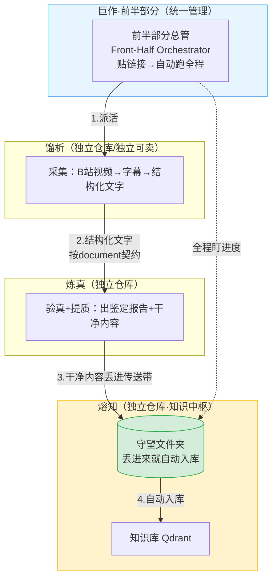

# 巨作「前半部分」整合研究报告

> 研究日期：2026-07-11 ｜ 视角：软件架构师（架构通，延续 2026-07-08 架构评审）
> 触发：用户提出——馏析/炼真/熔知这条"B站视频→转字幕→分析→入库"路线已跑通，希望把三者作为巨作（Opus Magnum）**前半部分统一管理**，同时**三个项目仍能单独管理**。
> 性质：🔬 调研 + 🛑 规划（无版本号）。本报告只给方案与推荐，**不含任何代码改动**，等你拍板后再动手。

---

## 一句话结论

**你要的整合，不用推翻重来。** 三个项目之间的"接口零件"其实已经躺在那里了——共享契约（schemas）、熔知的守望文件夹、各自能被调用的处理模块。我们要做的，是**加一层"前半部分编排器"把现有零件串成一条自动线**，而不是把三个项目焊死成一坨。

推荐路线一句话：**三个项目继续各是各的独立仓库（保住"单独管理"和未来单独卖），巨作层新增一个"前半部分总管"，靠"文件夹当传送带"把三段自动接起来（实现"统一管理"）。**

---

## 二、先说清楚：什么叫"前半部分"

巨作的完整愿景是一条闭环：

```
学习模仿 → 真伪验证 → 知识积累 →（分界线）→ 内容创作 → 多平台分发 → 私域经营
   馏析        炼真        熔知                    凝华          凝华          凝华
└──────────── 前半部分：把知识炼出来存好 ──────────┘ └──── 后半部分：拿知识去赚钱 ────┘
```

- **前半部分 = 输入侧 = 馏析 + 炼真 + 熔知**：把外部世界的噪音，炼成你私有知识库里干净、可信、能照做的知识。
- **后半部分 = 输出侧 = 凝华 + 总指挥部**：把知识拿去接单、创作、变现。

你现在要整合的，正是**前半部分这三器**。它们天然是一条流水线（采集→验真→存储），本来就该一起跑。

---

## 三、好消息：整合的"接口零件"已经存在

这次调研发现，三个项目之间的连接点大部分是现成的，不用从零造：

| 现有零件 | 在哪 | 整合时的作用 |
|---------|------|-------------|
| **共享契约（5 份）** | `D:\opus-magnum\schemas\`（document / video_meta / claim / contradiction_report / task） | 三者之间传递内容的"标准包裹单"——上游按这个格式装，下游按这个格式拆，接口不会对不上 |
| **熔知守望文件夹** | 熔知 `watcher_v2.py` | 一个文件夹，往里丢文件就**自动入库**。这就是天然的"传送带终点"——炼真炼完，把成品丢进这个文件夹，熔知自己就收了 |
| **馏析产出模块** | 馏析 `core/`（字幕/下载/分析）+ `run_queue.py` 队列 | 已能把 B站 视频变成结构化文字，且已有队列机制（可排队处理） |
| **炼真流水线** | 炼真 `flows/refine.py` | 已能"丢一段文字→出鉴定报告 + 干净内容"，切片 A 全闭环 |

**结论**：三段管子都已经通了，只差把它们**首尾接起来 + 加一个总开关**。

---

## 四、核心难题：既要"合"，又要"分"

你的需求里藏着一对天然矛盾，这是整个整合方案的命门：

- **要"合"（统一管理）**：三者作为前半部分一起跑，最好"贴个链接就自动跑完全程"。
- **要"分"（单独管理）**：每个项目还能独立开发、独立启动、**尤其馏析未来要单独当产品卖**。

如果整合方式选错，就会牺牲其中一头。所以下面三个方案，核心区别就是**怎么在"合"和"分"之间取平衡**。

---

## 五、三个候选方案对比

### 方案 A：合并成一个大仓库（Monorepo）

把三个项目收进巨作一个仓库，当子目录管理。

| | |
|---|---|
| 👍 好处 | 一次克隆全都有；跨项目改动一个提交搞定 |
| 👎 坏处 | **单独卖时要动大手术**（把馏析从大仓库里拆出来，git 历史会很乱）；三个项目各自的独立版本管理被打乱 |
| 适合谁 | 永远不打算单独卖任何一个项目的团队 |
| **对你** | ❌ **不推荐**——直接违背你"馏析未来要单独卖"的诉求 |

### 方案 B：独立仓库 + 前半部分编排器（文件夹当传送带）⭐ 推荐

三个项目**保持各自独立的仓库、蓝图、启动脚本**（"分"完全保住）；巨作层新增一个"前半部分总管"，靠**约定文件夹 + 共享契约**把三段自动串起来（"合"也做到）。

| | |
|---|---|
| 👍 好处 | 完美兼顾"合"与"分"；改动最小（几乎不动三个项目内部）；未来单独卖馏析＝直接把它的独立仓库拿走，零成本；**充分复用现有零件**（守望文件夹、契约） |
| 👎 坏处 | 三段之间是"文件传递"，不是"函数直接调用"，会有几秒延迟（对你单人用完全无所谓） |
| 适合谁 | 单人、多项目、其中某些未来要独立售卖——**正是你的情况** |
| **对你** | ✅ **强烈推荐** |

### 方案 C：焊成一个进程（真·模块化单体）

把三个项目的核心代码合并成一个程序的三个模块，互相直接调用函数。

| | |
|---|---|
| 👍 好处 | 零延迟、原子启动（要么全活要么全死） |
| 👎 坏处 | **依赖地狱**——三者用的"工具箱"差异巨大（馏析要视频下载+语音识别+显卡；熔知要向量数据库+大模型嵌入；炼真只要联网调 AI），硬塞进一个环境极易打架；单独卖时最难拆 |
| 适合谁 | 依赖轻、且永不单独售卖的项目群 |
| **对你** | ❌ **不推荐**——依赖太重、且和"单独卖"冲突。架构评审当初说的"同进程模块"是理想态，但你这三个项目的依赖现实决定了短期不该焊死 |

---

## 六、推荐方案详解（方案 B）

### 6.1 整体形态：三段独立 + 一个总管 + 一条传送带



### 6.2 五个关键设计点

1. **传送带 = 文件夹**（本地消息总线）
   - 馏析产出 → 写进炼真的"待处理文件夹"
   - 炼真炼完 → 写进熔知的"守望文件夹"
   - 熔知守望文件夹已经会自动入库（现成的！）
   - 好处：三段之间彻底解耦，任何一段单独跑也不受影响。

2. **共享契约 = 标准包裹单**（复用现有 `schemas/`）
   - 三段传递的内容都按 `document.schema.json` 装箱，谁也不会接不住谁。
   - 未来做成"共享校验库"：上游写完先自检合格才发货，接口 bug 提前拦掉。

3. **前半部分总管 = 统一管理的入口**
   - 它就是实现验收标准①"一句话触发"的那个东西：你贴一个 B站 链接，它依次派活给馏析→炼真→落熔知，全自动。
   - 它同时是"前半部分看板"：三段各自在忙什么、队列里堆了几条、哪条失败了，一屏可见。

4. **双模式并存**
   - **单独管理**：每个项目的 `run.bat` 照旧，独立开发、独立测试、独立卖——完全不受整合影响。
   - **统一管理**：新增 `run-all.bat`（按顺序起熔知+守望+总管），跑整条前半部分流水线。

5. **演进可逆**（架构评审的乐高原则）
   - 现在是"三块独立积木 + 一个卡扣"。将来馏析要单独卖，直接把它那块积木拿走，卡扣留给别人——零改动成本。

### 6.3 落地演进路线（最小改动优先，诚实版）

| 阶段 | 做什么 | 为什么先做这个 |
|------|--------|--------------|
| **第 1 步（MVP）** | 把"已跑通的 B站 路线"用**文件夹传送带 + 契约**串成一条自动线：加一个最简单的"前半部分总管"脚本，不动三个项目内部 | 用最小改动，先让"贴链接→自动入库"真正跑通一次。这是整合的核心价值 |
| **第 2 步** | 给总管加一个**前半部分看板**（复用巨作现有的仪表盘），三段进度/队列一屏可见 | 让"统一管理"看得见、管得着 |
| **第 3 步** | 把 `schemas/` 做成**共享校验库**，三段发货前自检 | 接口从此不会对不上，卖出去也更专业 |
| **以后** | 仅当某项目要卖 → 它本就是独立仓库，直接拿走 + 补上对外的正式接口 | 不提前为"卖"买单，到时候再干 |

### 6.4 这套方案怎么满足你的验收标准

| 巨作验收标准 | 这套方案怎么达成 |
|-------------|----------------|
| ① 一句话触发，自动跑完全程 | 前半部分总管 = 那个"一句话入口" |
| ② 内容有据可查（能溯源） | 炼真本来就产出溯源信息，随契约一路带到熔知 |
| ③ 虚假信息自动拦截 | 炼真的"可疑/虚假"标记随内容进熔知，脏东西进不来 |
| ④ 知识自动积累 | 熔知守望文件夹自动入库，越攒越多 |

---

## 七、要请你拍板的三件事

在动手之前，有三个决策点需要你确认（都用大白话）：

1. **方案选哪个？** 我推荐 **方案 B（独立仓库 + 传送带）**。你认可，还是想聊聊别的？

2. **"前半部分总管"放在哪个项目里？** 我建议放在**巨作（Opus Magnum）**——它本来就是"总指挥部/调度",天生该干这活。

3. **第 1 步 MVP 的范围**：只把**现有 B站 那条路线**串成自动线（不加新功能、不动三个项目内部逻辑）。你同意这个最小范围，我就从这里开工。

---

## 八、和上次架构评审的关系

本报告是 2026-07-08《Opus Magnum 系统架构评审》的**落地续篇**：
- 评审当时定调"模块化单体 + 可演进，别现在就分布式"——本方案完全继承。
- 评审预设的触发点是"Nigredo B站流程跑通 / Albedo 开工"——现在两件都成了（B站跑通、炼真切片 A 闭环），所以整合水到渠成。
- 唯一的现实修正：评审理想里说"同进程五模块"，但三个项目**依赖太重**（视频/语音/向量库/显卡各不相同），所以前半部分整合先用**"独立仓库 + 文件传送带"**这种更轻、更可逆的形态，而不是立刻焊成一个进程。等真有必要再往里收。

---

---

## 九、统一更新工作流：你只在巨作画布里改，结果准确落到正确仓库

> 用户关切（2026-07-11 追加）：不想在三个项目间切来切去；要确认"把三个当巨作项目更新"时，改动能准确传到正确文件夹。

**解答：能，而且可靠。** 机制如下：

- **你在巨作画布里看到三个"快捷方式文件夹"**：`front_half/nigredo`、`front_half/albedo`、`front_half/citrinitas`。它们不是复制件，而是指向真实仓库 `D:\nigredo` / `D:\albedo` / `D:\citrinitas` 的**目录联接（junction，Windows 的"文件夹快捷方式"）**。
- **你改快捷方式 = 改真实仓库**。比如你说"改馏析的下载器"，我编辑 `front_half/nigredo/...`，这个文件**就是** `D:\nigredo\...` 本身，改动自动落到正确文件夹，不会跑偏、不会投错。
- **git 提交/推送由各真实仓库各自管**，这部分由我代劳——你在哪个项目说"提交"，我就提交到那个仓库并推送。你全程只在一个对话（巨作画布）里。
- **三段之间的投递靠"固定文件夹 + 共享契约"**，不是靠猜：上游按契约装箱、下游按契约拆箱，所以"馏析的产出"永远准确进"炼真的入口"，"炼真的成品"永远准确进"熔知的守望文件夹"。

**为什么不用 Monorepo / git 子模块**：对"单人 + 未来要单独卖馏析"的场景，它们反而更折腾——子模块提交要切来切去、Monorepo 卖的时候要拆。目录联接 + "我当你的手脚"是最轻、最不折腾、又完全满足"不切换"的方案，且和方案 B（独立仓库）天然契合。

---

---

## 十、接口实测（动工前核查，2026-07-11）🔬

> 用户要求"做之前先研究清楚"。本章是真实读码后的接口盘点，未改任何代码。

### 10.1 三段真实接口（好消息：都能被程序调用，不用改内部）

| 段落 | 真实入口（代码标识符保留） | 输入 | 输出 |
|------|--------------------------|------|------|
| **馏析** | `core/downloader.DownloadManager().process(url)` | B站链接 | `dict{status, video_id, info, audio_path, subtitle.full_text}`；另落盘 `{bv}.txt`/`.srt` 到 cache |
| **炼真** | `flows/refine.refine_text(text, text_type, title, up_name, source_url, video_id, signals)` | 纯文本（字幕） | `RefinedKnowledgeObject`：含 `.report`（人读鉴定报告字符串）+ `.to_json()`（结构化） |
| **熔知收件箱** | `D:\citrinitas\data\inbox\`（**已重构**：`watcher_v2.py` 单文件 → `watcher/` 包；路径由 `data/watch` 改为 `data/inbox`） | 丢文件进去 | 通用文本摄入：认 `.txt/.md/.json/.csv/.log`，读文件文本 → 切块 → 嵌入 → 入库 |

### 10.2 两处必须更正（vs 之前报告）

1. **熔知入口已变**：之前写的"丢进守望文件夹 `watcher_v2.py`"已过时。现是 `watcher/` 包 + `data/inbox/`，且**必须熔知服务在运行**（其 `run.bat` 起 watcher 监听）才生效。总管运行时需先确保熔知已开。
2. **共享契约 `document.schema.json` 两端都不消费**：炼真吐 `RefinedKnowledgeObject`（含 report/summary/quality/merits/sop/provenance/status/monetization/ingestion_meta），熔知收件箱只把文件当**纯文本**读。所以原计划 M1 的"契约校验"实际要做的是**映射/适配层**（把炼真产出包成熔知收件箱认的形式），不是"校验现有契约"。

### 10.3 待你拍板的三个问题（Phase 1.5）

- **Q1 总管形态**：MVP 先用**命令行脚本**（双击 `front_half\run.bat` → 粘贴 B站链接 → 回车 → 自动跑完并窗口报告结果），还是现在就要带按钮/进度的界面？（看板原本排在第 2 步）
- **Q2 丢进熔知收件箱的"包裹"形式**：
  - (a) 丢**炼真的鉴定报告 `.md`** → 熔知存的是"干净、能照做的知识"，最贴合你"炼成知识"的目标 ⭐推荐
  - (b) 丢**完整 JSON**（含所有字段）→ 完整但杂（报告+元数据都变搜索片段）
  - (c) 原样丢 → 糙
- **Q3 炼真判"可疑/虚假"时怎么办**（对应验收③虚假拦截）：
  - (a) **硬拦截**：`status=rejected`(虚假) 直接不丢进熔知；`suspect`(可疑) 丢但标注 ⭐推荐
  - (b) 都丢，靠报告文字让人自己判断
  - (c) 都丢不标

### 10.4 告知项（非决策，你清楚即可）

- **凝华（后半部分）本次不整合**：只做前半部分（馏析→炼真→熔知）。
- **运行环境（已更正）**：整合流程可由 AI 在当前执行环境直接跑通（用户已多次验证），无需你本机手动双击。你只在对话里说一句，我来驱动全程。

---

## 十一、最终决策锁定（2026-07-11 · 用户拍板 Q1/Q2/Q3 + 沙箱更正）

### Q1 = 带界面的总管（不是命令行）
前半部分总管从一开始就做成**带按钮 + 进度条的界面**（技术上用 NiceGUI，与熔知/凝华一致）：贴 B站 链接 → 点「开始」→ 界面实时显示「下载字幕 → 炼真精炼 → 投递入库」三段进度 → 跑完给结果卡。

### Q2 = 炼真直接产出「熔知专用 + 人可读」的成品文件，原样投递
放弃"总管事后拼装/适配"，改为**炼真自身产出一个合体文件**，同时满足：
- **主：为熔知设计** —— 文件顶部一段结构化「信息头」（来源 / 真伪结论 / 信任分 / 变现标注 / 分面预填），熔知读进来直接用，不用猜。
- **次：人可读** —— 信息头下面就是能直接看的鉴定报告（Markdown）。
- 总管把这个文件**原样丢进熔知收件箱**，中间不再加适配层。
- 技术落点：给炼真加一个「熔知-ready 导出」——正是炼真**切片 B（ingestion_meta 熔知分面预填）的提前落地**。

合体文件长这样（示意）：
```markdown
---
source_url: https://www.bilibili.com/video/BVxxxx
title: 视频标题
up_name: UP主
verdict: suspect          # accepted 真 / suspect 可疑 / rejected 虚假
trust_score: 0.42         # 0–1 信任分
monetization: 知识付费     # 变现标注（若有）
facets: {domain: "3 社会科学", content_type: "经验方法"}   # 熔知分面预填
---

# 鉴定报告
（这里是人能直接看的：结论卡 / 摘要 / 优点 / 结构化步骤 / 溯源 / 数值预检）
```

### Q3 = 不硬拦截，全部入库；由熔知负责「标注虚假」
- 炼真判「可疑/虚假」**不再拦在门口**，内容照常进熔知（原 Q3 选项 b）。
- 真伪结论随 Q2 信息头进熔知，熔知用它：① 存进已有的真伪/信任字段（epistemic_status / trust_score）② 界面给「可疑/虚假」打标签，并支持按真伪过滤。
- 即「标注虚假」是**熔知的一个功能**（小增量，复用熔知已规划的分面基建）。

### scope 变化说明（诚实告知）
Q2/Q3 让 MVP 从「纯编排、不碰子项目内部」扩为**轻度触及炼真 + 熔知内部**：炼真加「熔知-ready 导出」、熔知加「信息头解析 + 虚假标注」。这与你"三项目设计成一体"的目标一致、一步到位，但比"只搬管子"多两处子项目小改。三项目仍各自独立仓库/可单独卖，不受影响。

### 更新后的 MVP 任务清单
| 任务 | 做什么 | 落在哪 |
|------|--------|--------|
| **M0 统一视图 + 总管UI骨架** | `front_half/` 建目录联接指向三真实仓库；NiceGUI 总管骨架（贴链接框 + 开始按钮 + 进度区） | 巨作 Opus Magnum |
| **M1 炼真熔知-ready导出** | 炼真加「信息头 + 人读报告」合体文件导出 | 炼真内部（小改） |
| **M2 熔知信息头解析 + 虚假标注** | 收件箱读信息头 → 映射 epistemic_status/trust → UI 标「可疑/虚假」+ 过滤 | 熔知内部（小改） |
| **M3 总管串 B站 路线** | 贴链接 → 馏析出字幕 → 炼真产合体文件 → 投熔知收件箱 → 自动入库，界面显进度 | 巨作 Opus Magnum |
| **M4 端到端验收** | 真实 B站 链接跑通，结果进熔知并带真伪标注 | 全链路 |

---

## 十二、统一启动脚本设计（用户追加诉求 2026-07-11）

### 12.1 现状盘点（实测，各项目风格不统一）
| 项目 | 启动脚本 | Python 来源 | 端口 | 检查逻辑 | 横幅 |
|------|---------|------------|:--:|---------|------|
| Opus Magnum | `run.bat` | venv | 8500 | venv+依赖+.env | 简单 |
| Nigredo | `run.bat` | 系统 python | 8502 | 依赖检查+先跑队列 | 简单横幅 |
| Albedo | `run.bat` | 系统 python | 8501 | 只查 streamlit | 极简 |
| Citrinitas | `run.bat` | venv | 8080 | 8步：提权+Qdrant+Ollama+收件箱 | 完整★横幅 |
| Rubedo | `run.bat` | 系统 python | **8081**（记忆误记 8765） | 依赖检查 | 简单 |

**不统一之处**：Python 环境分裂（有的 venv、有的系统 python）、端口没写进文档、横幅风格各异、依赖检查逻辑不一致、缺"一键拉起前半部分"的总入口。

### 12.2 推荐方案：双管齐下
**(a) 统一各项目 run.bat 模板** —— 五项目全用同一套：
- 统一横幅（项目名+版本+端口+★成功横幅+自动开浏览器）
- 统一 Python 策略：**优先项目自己的 venv，回退系统 python**（消灭"有的 venv 有的系统"的分裂）
- 统一依赖检查（缺则装 requirements.txt）
- 统一端口规划表（写进 `docs/PORTS.md`，防以后冲突）

**(b) 巨作加「总启动器」** —— `D:\opus-magnum\front_half\launch.bat`：
- 前半部分跑通要求「熔知收件箱在监听」才能入库，所以总启动器**按顺序拉起**：先熔知 → 再前半部分总管（可选同时拉起馏析/炼真 UI）
- 双击它 = 前半部分整套就绪，不用分别开三个窗口

### 12.3 端口规划（固定下来，写文档）
| 服务 | 端口 |
|------|:--:|
| Opus Magnum 总管 | 8500 |
| Albedo 炼真 | 8501 |
| Nigredo 馏析 | 8502 |
| Citrinitas 熔知 | 8080 |
| Rubedo 凝华 | 8081 |

---

## 十三、开源 + 收费设计（用户追加诉求 2026-07-11）

### 13.1 模式：open-core（开源核心 + 闭源增值）
「大部分开源、核心收费」= 业界标准 **open-core**。关键不在开源多少，而在**核心收费功能必须物理隔离**，否则一开源就白给。

### 13.2 物理隔离三方案（最关键的架构决策）
| 方案 | 做法 | 优点 | 风险 |
|------|------|------|------|
| **A 私有仓库+本地激活码** ⭐ | 核心算法放私有仓库/子模块，开源版 import 不到就降级或提示购买；本地激活码解锁 | 代码不公开、本地跑、最贴"本地一人公司" | Python 易反编译，激活码可被破解（个人产品够用） |
| B 核心走云端 API | 开源版调云端精炼接口（需 key），核心逻辑不在本地 | 代码天然不暴露、最难抄 | 要服务器成本、依赖联网、背弃"本地优先" |
| C 全开源靠服务收费 | 代码全公开，靠支持/更新/托管收费 | 最简单、社区友好 | 谁都能白嫖，核心无保护 |

**推荐 A**：你明确要本地一人公司、代码自己机器跑，A 最契合；B 要服务器、冲突；C 等于没保护。

### 13.3 授权 / License Key 机制（方案 A 下怎么收钱）
- **离线激活码**：机器指纹（硬件ID）+ 签名校验，双击激活。简单、无服务器。
- **功能门控**：核心函数前 `if not license.active: 提示升级`。
- 进阶段可加在线激活（可远程吊销），首版离线足够。

### 13.4 本项目开源 / 闭源映射（初版建议）
**开源（MIT，鼓励采用）：**
- 采集适配器（B站/企微骨架）、基础入库流程、全 UI、schema 契约、文档、统一启动脚本
- 炼真：基础质量评估（规则版）
- 熔知：全文检索 + 基础分面

**闭源收费（私有仓库 + 激活码）：**
- 炼真 **Crucible 信任聚合算法**、**跨源矛盾检测**、**高质量精炼提示词工程**
- 熔知 **高级语义搜索 / 知识关系网**
- **多用户 / 团队协作 / 云端同步**
- **授权与激活模块本身**

**收费分层：**
- 个人本地版：免费（单机、单用户、社区精炼）—— 引流+口碑
- 专业版（激活码）：解锁 Crucible / 矛盾检测 / 高级搜索
- 团队版：多用户 + 云端同步

### 13.5 现有 LICENSE 现状（硬约束）
- Citrinitas 已是 **MIT**（可商用、可再授权）✅
- Nigredo / Albedo / Opus Magnum **无 LICENSE** → 法律默认"保留所有权利"，**现在不能开源**，必须先补 LICENSE
- 转开源：要开源的补 MIT + README；核心闭源部分保持 private 或单独商业 EULA

### 13.6 现在做多少（建议）
- **现在就做**：① 定目录隔离边界（`core/` 开源 vs `core/premium/` 闭源子模块）② 补各项目 LICENSE（开源的 MIT，闭源的商业 EULA）③ 端口/启动规范化
- **以后再做**：激活码模块（等整合 MVP 跑通、确定哪些是"核心"后再实现，避免过早锁死）

---

## 十四、已拍板的问题（统一启动 + 开源收费）—— 2026-07-11 用户确认

**统一启动：**
- **U1 = c** 两者都要（统一各 run.bat 模板 + 加巨作总启动器 `front_half\launch.bat`）
- **U2 = a** 全统一 venv（优先项目自己的 venv，回退系统 python）

**开源收费：**
- **S1 = a** 私有仓库 + 本地激活码（方案 A）
- **S2 = a** 个人本地版免费 + 专业版激活码 + 团队版
- **S3 = a** 现在只定隔离结构 + 补 LICENSE，激活码模块等整合 MVP 跑通后再写

**用户追问题（本次新增）：** 现有依赖里有没有不能商用的？→ 见第十五节审计。

---

## 十五、依赖商用合规审计（用户追问题，2026-07-11 实测）

我把四个项目的 `requirements.txt` 逐一核了授权。结论：**绝大多数依赖都是宽松授权（MIT/Apache/BSD/Unlicense/ISC），可放心商用**；但有 **1 个 AGPL 硬伤 + 2 个 LGPL 雷点 + 1 个 ToS 合规风险** 需要处理。

### 15.1 按项目逐一看（✅=可商用 ⚠️=需处理）

**Nigredo（馏析）— 全 ✅，仅 ToS 风险**
| 依赖 | 授权 | 商用 |
|------|------|:--:|
| yt-dlp | Unlicense（公共领域） | ✅ 但⚠️见下 |
| faster-whisper / ctranslate2 | MIT | ✅ |
| huggingface_hub | Apache 2.0 | ✅ |
| bilibili-api-python | MIT | ✅ |
| requests / openai / pandas / numpy / streamlit / plotly / python-dotenv / rich | Apache/MIT/BSD | ✅ |

**Albedo（炼真）— 全 ✅**
| 依赖 | 授权 | 商用 |
|------|------|:--:|
| streamlit / requests / python-dotenv（LLM 经 openai/requests 调 DeepSeek） | Apache/MIT/BSD | ✅ |

**Citrinitas（熔知）— 1 个 AGPL 硬伤 ⛔ + 1 个 LGPL ⚠️**
| 依赖 | 授权 | 商用 |
|------|------|:--:|
| nicegui / fastapi / uvicorn / qdrant-client / grpcio / openai / huggingface_hub / beautifulsoup4 / pypdf / python-docx / python-pptx / lxml / fpdf2 / pillow / jieba / watchdog / paddlepaddle / paddleocr | MIT/Apache/BSD | ✅ |
| **ebooklib（EbookLib）** | **AGPL-3.0** | ⛔ **硬伤** |
| chardet（若 <7.0.0） | LGPL-2.1 | ⚠️ 旧版 |
| chardet（≥7.0.0，2026 重写版） | MIT | ✅ |

**Opus Magnum（巨作）— 1 个 LGPL ⚠️**
| 依赖 | 授权 | 商用 |
|------|------|:--:|
| streamlit / requests / pandas / pyarrow / jsonschema / python-dateutil / python-dotenv | Apache/MIT/BSD | ✅ |
| **pygithub（PyGithub）** | **LGPL-3.0** | ⚠️ |

**Rubedo（凝华，未来整合）— 全 ✅**
| 依赖 | 授权 | 商用 |
|------|------|:--:|
| DayPilot Lite（日历组件） | Apache 2.0 | ✅ 可商用 |
| NiceGUI 等 | MIT | ✅ |

### 15.2 三个必须处理的点（含改法）

**⛔ 硬伤 1：ebooklib = AGPL-3.0（Citrinitas 在用）**
- AGPL 是「强拷贝授权」：一旦你的产品（熔知）导入它并分发，就必须把**整个熔知对应源代码**也以 AGPL 开源——这直接摧毁"核心闭源收费"模式。
- **改法**：EPUB 本质就是 ZIP+XHTML，用熔知**已经依赖**的 `zipfile` + `lxml` / `beautifulsoup4`（都是 MIT/BSD）自写一个轻量 EPUB 解析函数即可，**零新增依赖、彻底消除 AGPL**。删掉 `ebooklib` 这一行。

**⚠️ 雷点 2：pygithub = LGPL-3.0（Opus Magnum 在用）**
- LGPL 是「弱拷贝授权」，动态调用（Python import）本身允许闭源商用，但为保持核心干净、避免任何纠缠，**建议换成 `requests` 直接调 GitHub REST API**（Opus Magnum 只是用它管仓库，requests 已依赖）。删 `pygithub`，省一个授权包袱。

**⚠️ 雷点 3：chardet 旧版 = LGPL-2.1（Citrinitas 在用）**
- 旧版 chardet（<7.0.0）是 LGPL；**2026 年的 7.0.0 已重写为 MIT**。把 `chardet>=5.0.0` 改为 `chardet>=7.0.0` 即可变 ✅；更干净的做法是直接依赖 `charset_normalizer`（MIT，requests 现在默认用的就是它），连 chardet 都不用写。

### 15.3 非 license 但必须知道的合规风险

**yt-dlp + B站 ToS（Nigredo 商品化时的风险）**
- yt-dlp 本身是公共领域（Unlicense），**授权完全可商用**；但注意两点：
  1. **别打包它那个 PyInstaller 版 .exe**——那个 exe 内含 GPLv3+ 代码。用 `pip install yt-dlp`（wheel 是纯 Unlicense）就行。
  2. **真正的雷是 B站服务条款**：自动化下载 B站视频可能违反 B站 ToS。当你把馏析当商品卖时，这是法律/合规风险，不是代码授权问题。建议：商品化时只处理用户自己上传/CC 协议的内容，或请法律过一遍 B站抓取条款。

**模型授权（都 OK，但要守规矩）**
- **Qwen3-Embedding（熔知嵌入模型）= Apache 2.0**：可商用、可闭源，但**必须保留 NOTICE 版权声明、产品名不能用"Qwen"商标**。
- **DeepSeek（炼真调的 LLM）= 模型 MIT / API 按商家条款**：可商用。

### 15.4 审计结论
- 除 ebooklib（AGPL）必须替换外，其余都"可商用"。
- pygithub / chardet 两个 LGPL 项建议顺手清理，让闭源核心零拷贝授权包袱。
- 这些替换都是"换依赖/自写小函数"，**不动业务功能**，可在 M0 阶段（统一启动 + 补 LICENSE）一并处理。

---

## 十六、已锁定决策总览（整合开工前的全部拍板）

**整合架构（第十一节）：**
- Q1 = b：总管一开始就有界面（贴链接 + 开始按钮 + 三段进度）
- Q2 = 炼真产出「熔知专用 + 人可读」合体文件（信息头 + 报告正文），总管原样投递，不加中间层
- Q3 = b：不拦截，内容全入库；真伪结论随信息头进熔知，熔知负责打「可疑/虚假」标签 + 过滤
- 后半部分（凝华）本次不整合

**统一启动（第十四节）：**
- U1 = c：统一 run.bat 模板 + 加巨作总启动器
- U2 = a：全统一 venv

**开源收费（第十三/十四节）：**
- S1 = a：私有仓库 + 本地激活码（方案 A）
- S2 = a：个人免费 + 专业版激活码 + 团队版
- S3 = a：现在只定隔离 + 补 LICENSE，激活码以后写

**依赖合规（第十五节）：**
- 替换 ebooklib（AGPL→自写 EPUB 解析）；清理 pygithub / chardet（LGPL→requests / charset_normalizer）

---

## 第十七节 M0 实施记录（2026-07-09）

M0（前半部分整合骨架）已落地，全部步骤完成：

| 步骤 | 内容 | 状态 |
|------|------|:--:|
| M0-1 统一视图 | `D:\opus-magnum\front_half\nigredo\|albedo\|citrinitas` 三个目录联接指向真实仓库；`.gitignore` 忽略这三个联接（保留 `supervisor/` 真实代码） | ✅ |
| M0-2 总管骨架 | `front_half/supervisor/orchestrator.py`（编排逻辑，可单测）+ `app.py`（NiceGUI 界面，端口 8503，带进度条）+ `requirements.txt`（nicegui） | ✅ |
| M0-3 统一启动 | 4 个 `run.bat`（nigredo/albedo/rubedo/opus）统一模板（venv 优先+回退+★横幅）；Citrinitas 因 8 步关键流程保持原样；新增 `front_half/launch.bat` 总启动器（先起熔知→等 8s→起总管）+ `docs/PORTS.md` | ✅ |
| M0-4 补 LICENSE | nigredo / albedo / opus-magnum 补 MIT LICENSE（Citrinitas 已有） | ✅ |
| M0-5 依赖清理 | 移除 AGPL `ebooklib`（自写 `utils/file_handler/epub_reader.py` 平替）；`chardet`→MIT `charset_normalizer`；Opus 移除 LGPL `pygithub`（改 `requests` 调 GitHub REST API） | ✅ |

**M0-5 验证**：`epub_reader.py` 纯标准库实现，最小 EPUB 冒烟测试 + Citrinitas 真实 `_metadata_epub` 集成测试均通过（Dublin Core 元数据、图片项、spine 顺序文档项正确；`urn:isbn:` 前缀正确去除）。改动文件全部 `py_compile` 通过。

*本文档随整合推进更新。全部决策已锁定（Q1-Q3 / U1-U2 / S1-S3 + 依赖审计），M0 已落地。下一步：M1（炼真加信息头导出）/ M2（串真实 B站路线）/ M3（总管串起真实调用）/ M4（端到端验收）。*
