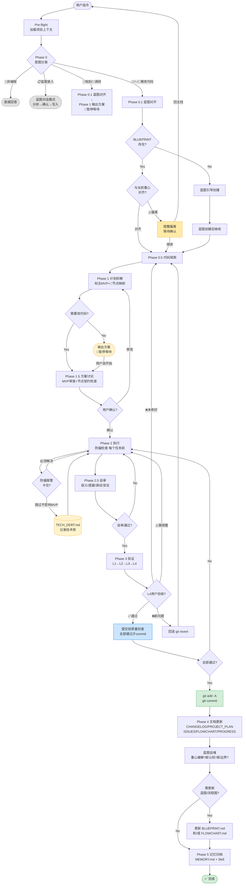

# Workflow · 项目管理流程 — 流程框图

> 展示 Phase Pre-flight → Phase 5 全链路数据流。
> 对应 SKILL.md v2.7。

---

## 主干流程图

每个编程任务经历这个闭环，保证可追溯、可回溯。
**纯规划、闲聊、蓝图录入则分流到短路径，不走完整体流程。**

---

## 节点定义

### 意图分类（Phase 0）

| 节点 | 名称 | 输入 | 输出 | 逻辑 |
|:--:|------|------|------|------|
| P0 | 意图分类 | 用户指令 | 路由到合适分支 | 语义分析：含"修/bug/fix"→🐛，含"新/添加/add"→✨，含"重构/改架构"→🔄，含"录入蓝图/加入蓝图"→📋，含"研究/调研/对比"→🔬，纯问题→💬 |

### 蓝图对齐（Phase 0.1）

| 节点 | 名称 | 输入 | 输出 | 逻辑 |
|:--:|------|------|------|------|
| P0_1 | 蓝图对齐 | BLUEPRINT.md + FLOWCHART.md | 对齐判断 | 读蓝图→判断任务与当前重心关系→输出对齐/偏离/不存在 |
| Guide | 蓝图引导创建 | 空 | BLUEPRINT.md + FLOWCHART.md | 逐节引导用户填写愿景/原则/重心/边界/验收 |
| P0_5 | 代码探索 | 项目目录 | 代码理解 | 搜索/阅读现有代码，理解架构 |

### 计划与讨论（Phase 1 → 1.5）

| 节点 | 名称 | 输入 | 输出 | 逻辑 |
|:--:|------|------|------|------|
| P1 | 计划拆解 | 用户需求 + 代码理解 | 任务清单 + 流程映射 | 拆 SMART 任务→标注 MVP必须/锦上添花→每个任务 📍映射到 FLOWCHART 节点 |
| P1_5 | 方案讨论 | 任务清单 | 用户确认的方案 | 逐任务讨论怎么实现→MVP 审查→节点契约检查→用户确认 |
| PausePlanning | 暂停等待 | — | — | 纯规划/调研到此暂停，等用户说"开始" |

### 执行与验证（Phase 2 → 3）

| 节点 | 名称 | 输入 | 输出 | 逻辑 |
|:--:|------|------|------|------|
| P2 | 执行 | 确认的方案 | 代码改动 | 按 Task ID 顺序执行，每个任务前做防偏检查 |
| P2_Drift | 防偏报警 | 任务状态 | 继续/跳过 | 卡住时判断：跳过对 MVP 有影响吗？ |
| TechDebt | 技术债 | 跳过的任务 | TECH_DEBT.md 条目 | 记录发现日期/阻塞版本/跳过原因 |
| P2_5 | 自审 | 代码改动 | 自审通过/不通过 | 语义正确性/遗漏路径/调试残留/安全问题 |
| P3 | 验证 | 代码改动 | 验证通过/不通过 | L1语法→L2单元+回归→L3服务→L4用户验收 |
| QC | 质量检查 | 验证通过的代码 | commit/rework | L1+L2+L3+L4+自审+无调试残留 → 全部通过才 commit |

### 文档与归档（Phase 4 → 5）

| 节点 | 名称 | 输入 | 输出 | 逻辑 |
|:--:|------|------|------|------|
| P4 | 文档更新 | commit 后的变更 | 更新的文档 | 根据意图类型更新 CHANGELOG/PROJECT_PLAN/FLOWCHART/ISSUES/PROGRESS |
| P4_BP | 蓝图反哺 | 当前实现 | 蓝图更新建议 | 检查：重心缓解了？新认知？新边界？需更新蓝图/流程图？ |
| P5 | 记忆归档 | 会话全量变更 | MEMORY.md + Skill | 重要变更→MEMORY，可复用流程→Skill |

---

## 连线表

| 起 → 止 | 触发条件 | 说明 |
|---------|---------|------|
| P0 → Chat | 意图=💬非编程 | 直接回答，不创建任务 |
| P0 → BlueprintEntry | 意图=📋蓝图录入 | 蓝图对话模式 |
| P0 → P0_1_Plan | 意图=🛑规划/🔬调研 | 输出方案后暂停 |
| P0 → P0_1 | 意图=🐛/✨/🔄 | 需改代码，进入蓝图对齐 |
| Align → P0_5 | 对齐 | 继续推进 |
| Align → WarnDiverge | 偏离 | 提醒用户，等待确认 |
| P1_Decision → PausePlanning | 纯规划 | 暂停等待 |
| P1_Decision → P1_5 | 需改代码 | 进入方案讨论 |
| P1_5_Confirm → P1 | 用户要求修改 | 回到拆解 |
| P1_5_Confirm → P2 | 用户确认 | 开始执行 |
| P2_Drift → TechDebt | 跳过不影响 MVP | 记录技术债 |
| P2_Drift → P2 | 必须解决 | 继续攻坚 |
| P2_5_Pass → P2 | 自审不通过 | 回到修复 |
| P2_5_Pass → P3 | 自审通过 | 进入验证 |
| P3_L4 → QC | 用户验收通过 | 质量检查 |
| P3_L4 → P0_5 | 用户说"还是坏的" | 重新探索 |
| P3_L4 → Revert | 用户说"出现新问题" | git revert 回滚 |
| P3_L4 → P2 | 用户说"需要调整" | 回到执行 |
| QC_Pass → P2 | 检查不通过 | 回到修复 |
| QC_Pass → Git | 全部通过 | git commit |
| P4_BP_Update → UpdateBP | 需要更新 | 更新蓝图/流程图 |
| P4_BP_Update → P5 | 不需要 | 直接归档 |
| PausePlanning → P1_5 | 用户说"开始" | 进入方案讨论 |

---

## 反馈回路（4 类）

| 回路 | 触发条件 | 路径 | 用途 |
|------|---------|------|------|
| 🔁 修复回路 | P2_5 自审未通过 | P2_5 → P2 | 内部修正 |
| 🔁 验证回路 | P3 L4 用户验收失败 | P3 → P0_5 / Revert / P2 | 用户驱动修正 |
| 🔁 防偏回路 | P2 卡住 | P2 → TechDebt / P2 | 止损 |
| 🔁 蓝图回路 | P4 蓝图反哺发现变化 | P4 → UpdateBP | 长期演化 |

---

> **版本**: v1 | **对应 SKILL.md**: v2.7 | **更新日期**: 2026-06-17
